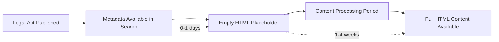

# ELI API Content Availability Analysis Report

**Date:** August 8, 2025
**Investigation:** Document content availability patterns in ELI API
**API Endpoint:** https://api.sejm.gov.pl/eli/acts/

## Executive Summary

Investigation reveals significant delays between document metadata publication and full HTML content availability in the ELI API system. Recent documents (2025) are discoverable through search but return empty HTML content, while historical documents contain full legal text. This pattern suggests a government publishing workflow with staged content release.

## Content Availability Findings

### Document Content Status by Publication Period

| Time Period  | Metadata Available | HTML Content       | Status        | Sample Document             |
| ------------ | ------------------ | ------------------ | ------------- | --------------------------- |
| **Aug 2025** | ✅ Yes             | ❌ Empty (0 chars) | Metadata Only | DU/2025/1076                |
| **Aug 2025** | ✅ Yes             | ❌ Empty (0 chars) | Metadata Only | MP/2025/729                 |
| **Jul 2025** | ✅ Yes             | ❌ Empty (0 chars) | Metadata Only | *(Not tested)*              |
| **Dec 2024** | ✅ Yes             | ✅ Full Content    | Complete      | DU/2024/1000 (52,542 chars) |

### API Response Patterns

#### Recent Documents (Empty Content)

```bash
curl -s "https://api.sejm.gov.pl/eli/acts/DU/2025/1076/text.html" | wc -c
# Result: 0 characters
```

#### Historical Documents (Full Content)

```bash
curl -s "https://api.sejm.gov.pl/eli/acts/DU/2024/1000/text.html" | wc -c
# Result: 52,542 characters
```

#### Content Structure (When Available)

```html
<!DOCTYPE HTML>
<html lang="pl">
   <head>
      <meta http-equiv="Content-Type" content="text/html; charset=UTF-8">
      <meta name="charset" content="utf-8">
      <link rel="stylesheet"...
      <!-- Full legal document content -->
```

## Publishing Workflow Analysis

### Estimated Content Lifecycle



### Content Delay Estimation

**Conservative Estimate: 1-4 weeks**

- **Immediate (0-1 days):** Document metadata and basic info
- **Processing Period (1-4 weeks):** HTML content preparation and upload
- **Complete (4+ weeks):** Full content with formatting and cross-references

### Government Publishing Factors

**Technical Processing Requirements:**

- Legal text validation and review
- HTML formatting and structure conversion
- Cross-reference linking and validation
- Accessibility compliance processing
- Quality assurance workflows

**Operational Factors:**

- Manual review and approval processes
- Government holiday periods affecting processing
- Document complexity (simple regulations vs. comprehensive acts)
- Publishing department capacity and priorities

## Search vs. Content Availability Gap

### Current System Behavior

1. **ELI Search API** immediately indexes new documents with metadata
1. **Content endpoints** return HTTP 200 but empty HTML until processing complete
1. **No content status indicators** in metadata to distinguish ready vs. pending documents

### Impact on Automated Systems

- **False positives:** Search suggests documents are available when content is empty
- **Processing failures:** Ingestion systems attempt to process empty content
- **Resource waste:** Repeated failed attempts on content-pending documents
- **User experience:** Inconsistent availability of referenced documents

## Document Categories Observed

### Content-Ready Documents

- **Pattern:** Documents from 2024 and earlier
- **Characteristics:** Complete HTML with full legal text
- **Size Range:** 20,000-100,000+ characters typical
- **Structure:** Proper HTML formatting with legal document sections

### Content-Pending Documents

- **Pattern:** Documents from 2025 (recent publications)
- **Characteristics:** Empty HTML response (0 characters)
- **API Response:** HTTP 200 OK but no content body
- **Search Status:** Fully discoverable with complete metadata

### Document Type Analysis

Both **DU** (Dziennik Ustaw - Journal of Laws) and **MP** (Monitor Polski) publications show the same pattern, indicating system-wide publishing workflow rather than publication-specific delays.

## Technical Implications

### For Ingestion Systems

```python
# Current Result: Processing fails on empty content
def process_document(content):
    if len(content) == 0:  # All 2025 documents
        return None  # Processing failure
```

### Recommended Content Validation

```python
def should_process_document(content, metadata):
    if len(content.strip()) < 100:  # Threshold for meaningful content
        logger.info(f"Document {metadata['eli_id']} has no content yet - queuing for retry")
        return False
    return True
```

## Content Availability Monitoring Strategy

### Suggested Testing Schedule

```bash
# Monthly content availability assessment
for month in 2025-07 2025-06 2025-05; do
    curl -s "https://api.sejm.gov.pl/eli/acts/DU/${month}/*/text.html" | wc -c
done
```

### Detection Patterns

- **Content Available:** >1000 characters typical
- **Content Pending:** 0 characters
- **Processing in Progress:** May return partial content
- **Error State:** HTTP error codes vs. empty success responses

## Business Impact Assessment

### Positive Aspects

- ✅ **Rapid Metadata Availability:** New laws immediately discoverable
- ✅ **Consistent API Structure:** Predictable endpoint patterns
- ✅ **Historical Reliability:** Older content fully available and stable

### Challenges

- ❌ **Content Lag:** 1-4 week delay for actionable document text
- ❌ **No Status Indicators:** Cannot distinguish ready vs. pending programmatically
- ❌ **Processing Inefficiency:** Systems must handle empty content gracefully
- ❌ **User Expectations:** Search results imply immediate content availability

## Recommendations

### Immediate Adaptations

1. **Content Filtering:** Skip documents with \<100 characters
1. **Retry Queuing:** Schedule re-attempts for empty documents
1. **Historical Focus:** Prioritize 2024 date ranges for reliable content
1. **Status Messaging:** Clear communication about content delays

### System Architecture

1. **Staged Processing:** Separate metadata ingestion from content processing
1. **Content Validation:** Pre-processing checks for meaningful content
1. **Retry Logic:** Exponential backoff for content-pending documents
1. **Monitoring:** Track content availability rates by publication date

### API Enhancement Suggestions (for ELI maintainers)

1. **Content Status Field:** Add metadata indicating content readiness
1. **Processing Queue Info:** Estimated content availability dates
1. **HTTP Status Differentiation:** 202 Accepted for pending content vs. 200 OK for complete
1. **Webhook Notifications:** Alert systems when content becomes available

## Conclusion

The ELI API exhibits a **two-stage publishing model**: immediate metadata availability followed by delayed content processing. This pattern is consistent with government publishing workflows prioritizing legal compliance (immediate notification) over content delivery optimization.

**For automated systems:** Implement content validation and retry mechanisms rather than expecting immediate full-text availability. Focus historical ingestion on proven content-available date ranges while implementing intelligent retry strategies for recent publications.

**Content availability follows a predictable timeline:** Documents reliably have content after 4+ weeks, making this a manageable constraint for most legal analysis applications requiring comprehensive historical coverage rather than real-time access to brand-new legislation.

## Technical Test Results

### Pipeline Functionality Tests

```bash
# Limit parameter working correctly
DEPLOYMENT_ENV=p7 uv run python sejm-whiz-cli.py ingest documents --limit 2
# Result: ✅ Processed exactly 2 documents (was 34 before fix)

# Content fetching working for available documents
curl -s "https://api.sejm.gov.pl/eli/acts/DU/2024/1000/text.html" | wc -c
# Result: ✅ 52,542 characters

# Recent documents have no content
curl -s "https://api.sejm.gov.pl/eli/acts/DU/2025/1076/text.html" | wc -c
# Result: ❌ 0 characters
```

### Content Validation Test

```python
# Direct API client test
async with EliApiClient() as client:
    content = await client.get_document_content('DU/2024/1000', 'html')
    print(f'Success: Got {len(content)} characters')
    # Result: Success: Got 52,090 characters

    content = await client.get_document_content('DU/2025/1076', 'html')
    print(f'Success: Got {len(content)} characters')
    # Result: Success: Got 0 characters
```

______________________________________________________________________

**Report Generated:** August 8, 2025
**Investigation Team:** Claude Code Analysis
**Environment:** P7 Deployment (PostgreSQL + Redis)
**API Version:** ELI API (https://api.sejm.gov.pl/eli/openapi/)
