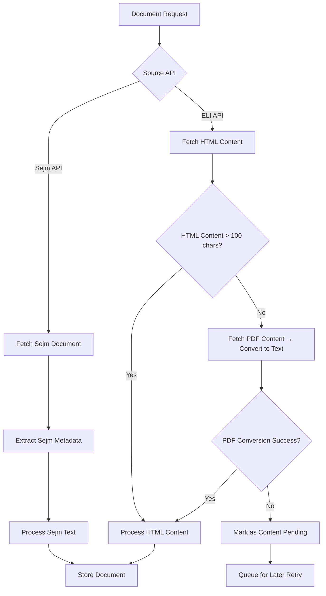

# Multi-API Document Content Implementation Plan

**Date:** August 8, 2025
**Objective:** Achieve working [Sejm API, ELI API] → act text, act metadata pipeline
**Priority:** High (foundational milestone for legal document processing system)

## Executive Summary

**Intermediate Goal:** Establish functional document retrieval from both Sejm API and ELI API sources to extract legal act text and metadata. This foundational milestone focuses on getting basic content extraction working reliably before pursuing advanced optimization.

**Current Challenge:** ELI API recent documents (2025) return empty HTML content, requiring PDF fallback strategy to achieve minimum viable content extraction rates.

**Success Criteria:** Achieve temporary quality targets as stepping stones toward comprehensive legal document processing system.

## Implementation Architecture

### Multi-API Document Processing Flow



### Enhanced Component Structure

```
components/sejm_whiz/sejm_api/
├── client.py                 # Enhanced Sejm API integration
└── metadata_extractor.py     # Sejm metadata processing

components/sejm_whiz/eli_api/
├── client.py                 # Enhanced with basic PDF fallback
├── pdf_converter.py          # NEW: Simple PDF-to-text conversion
└── content_validator.py      # NEW: Basic content quality checks

components/sejm_whiz/document_ingestion/
├── multi_api_pipeline.py          # NEW: Unified Sejm+ELI processing
├── cached_ingestion_pipeline.py   # Enhanced with basic fallback
└── content_retry_queue.py          # NEW: Simple retry mechanism

test/components/sejm_whiz/
├── test_multi_api_integration.py   # NEW: Cross-API integration tests
├── test_basic_pdf_conversion.py    # NEW: Basic PDF conversion tests
└── test_content_validation.py      # NEW: Content quality tests
```

## Implementation Tasks

**Revised Scope:** Focus on achieving basic multi-API document extraction with temporary quality targets as foundational milestone.

### Phase 1: Multi-API Integration Foundation (4 hours)

#### Task 1.1: Basic PDF Converter (2 hours)

**File:** `components/sejm_whiz/eli_api/pdf_converter.py`

**Simplified Implementation for Interim Goal:**

```python
class BasicPDFConverter:
    """Simple PDF-to-text converter for interim milestone."""

    def __init__(self, engine: str = "pdfplumber"):
        # Single engine implementation for now
        self.engine = engine

    async def convert_pdf_to_text(self, pdf_content: bytes) -> str:
        # Basic conversion without complex quality scoring
        # Goal: Get text extracted, even if imperfect

    def is_conversion_acceptable(self, text: str, min_chars: int = 50) -> bool:
        # Simple threshold-based validation
        return len(text.strip()) >= min_chars
```

**Dependencies to add:**

- `pdfplumber>=0.9.0` (MIT licensed, single engine for now)
- Alternative fallback: `pypdf>=5.0.0` (BSD-3-Clause licensed)

**License Compliance:** Both libraries use permissive licenses (MIT/BSD) suitable for commercial use. PyMuPDF excluded due to AGPL/commercial dual licensing.

**Estimated Time:** 2 hours

#### Task 1.2: Basic Content Validator (1 hour)

**File:** `components/sejm_whiz/eli_api/content_validator.py`

**Simplified for Interim Milestone:**

```python
class BasicContentValidator:
    """Simple content validation for interim goal."""

    MINIMUM_HTML_CHARS = 100
    MINIMUM_PDF_TEXT_CHARS = 50

    def is_html_content_usable(self, content: str) -> bool:
        """Basic HTML content check."""
        return len(content.strip()) >= self.MINIMUM_HTML_CHARS

    def is_pdf_text_usable(self, text: str) -> bool:
        """Basic PDF text check."""
        return len(text.strip()) >= self.MINIMUM_PDF_TEXT_CHARS

    def get_content_source_priority(self) -> List[str]:
        """Return content source priority: HTML first, then PDF."""
        return ["html", "pdf"]
```

**Interim Quality Metrics (Temporary Targets):**

- Minimum character count thresholds (relaxed)
- Basic text length validation
- Simple pass/fail decisions

**Estimated Time:** 1 hour

#### Task 1.3: Multi-API Document Processor (1 hour)

**File:** `components/sejm_whiz/document_ingestion/multi_api_pipeline.py`

**Unified Processing for Interim Goal:**

```python
class MultiApiDocumentProcessor:
    """Process documents from both Sejm API and ELI API."""

    async def process_document_from_any_source(self, document_id: str) -> DocumentResult:
        # Try to get content from available APIs
        # Priority: Sejm API first (more reliable), then ELI API with PDF fallback

    async def extract_act_text_and_metadata(self, source: str, content: str) -> ActDocument:
        # Basic text and metadata extraction
        # Goal: Get something working for both APIs
```

**Estimated Time:** 1 hour

### Phase 2: Enhanced API Client Integration (3 hours)

#### Task 2.1: Basic ELI Client PDF Fallback (1.5 hours)

**File:** `components/sejm_whiz/eli_api/client.py`

**Simplified Implementation for Interim Goal:**

```python
async def get_document_content_with_basic_fallback(self, eli_id: str) -> Dict[str, Any]:
    """Get document content with simple HTML→PDF fallback."""

    result = {
        "eli_id": eli_id,
        "content": "",
        "source": "none",
        "usable": False
    }

    # 1. Try HTML first
    try:
        html_content = await self.get_document_content(eli_id, "html")
        if self.content_validator.is_html_content_usable(html_content):
            result.update({
                "content": html_content,
                "source": "html",
                "usable": True
            })
            return result
    except Exception as e:
        logger.warning(f"HTML fetch failed for {eli_id}: {e}")

    # 2. Try PDF fallback (simplified)
    try:
        pdf_content = await self.get_document_content(eli_id, "pdf")
        if pdf_content:  # PDF endpoint returns bytes
            text = await self.pdf_converter.convert_pdf_to_text(pdf_content)
            if self.content_validator.is_pdf_text_usable(text):
                result.update({
                    "content": text,
                    "source": "pdf",
                    "usable": True
                })
                return result
    except Exception as e:
        logger.warning(f"PDF conversion failed for {eli_id}: {e}")

    # 3. Mark as pending (no manual queue for interim goal)
    logger.info(f"No usable content found for {eli_id} - marking as pending")
    return result
```

**Estimated Time:** 1.5 hours

#### Task 2.2: Enhanced Sejm API Integration (1.5 hours)

**File:** `components/sejm_whiz/sejm_api/client.py`

**Enhance existing Sejm API for act text/metadata extraction:**

```python
class SejmApiClient:
    """Enhanced Sejm API client for act text and metadata."""

    async def get_act_with_full_text(self, sejm_id: str) -> Dict[str, Any]:
        """Get legal act with full text content from Sejm API."""
        # Enhance existing methods to ensure text content retrieval

    async def extract_act_metadata(self, act_data: Dict) -> Dict[str, Any]:
        """Extract standardized metadata from Sejm API response."""
        # Standardize metadata format for consistency with ELI API

    def is_sejm_content_complete(self, act_data: Dict) -> bool:
        """Check if Sejm API returned complete act text."""
        # Basic validation for Sejm API content completeness
```

**Goal:** Ensure Sejm API can reliably provide act text as primary source.

**Estimated Time:** 1.5 hours

### Phase 3: Unified Pipeline Integration (3 hours)

#### Task 3.1: Multi-Source Document Processing (2 hours)

**File:** `components/sejm_whiz/document_ingestion/multi_api_pipeline.py`

**Create unified pipeline for both APIs:**

```python
class UnifiedDocumentPipeline:
    """Process documents from both Sejm API and ELI API sources."""

    def __init__(self, sejm_client, eli_client, cache_manager):
        self.sejm_client = sejm_client
        self.eli_client = eli_client
        self.cache_manager = cache_manager

    async def process_document_from_best_source(self, document_id: str) -> Dict[str, Any]:
        """Try multiple sources to get act text and metadata."""

        result = {
            "document_id": document_id,
            "act_text": "",
            "metadata": {},
            "source_used": "none",
            "success": False
        }

        # 1. Try Sejm API first (typically more reliable for full text)
        try:
            sejm_data = await self.sejm_client.get_act_with_full_text(document_id)
            if self.sejm_client.is_sejm_content_complete(sejm_data):
                result.update({
                    "act_text": sejm_data.get("text", ""),
                    "metadata": await self.sejm_client.extract_act_metadata(sejm_data),
                    "source_used": "sejm_api",
                    "success": True
                })
                return result
        except Exception as e:
            logger.warning(f"Sejm API failed for {document_id}: {e}")

        # 2. Try ELI API with PDF fallback
        try:
            eli_data = await self.eli_client.get_document_content_with_basic_fallback(document_id)
            if eli_data["usable"]:
                result.update({
                    "act_text": eli_data["content"],
                    "metadata": {"eli_id": document_id, "content_source": eli_data["source"]},
                    "source_used": f"eli_api_{eli_data['source']}",
                    "success": True
                })
                return result
        except Exception as e:
            logger.warning(f"ELI API failed for {document_id}: {e}")

        # 3. Mark as failed for retry later
        logger.warning(f"All sources failed for {document_id}")
        return result
```

**Estimated Time:** 2 hours

#### Task 3.2: Simple Retry Queue Implementation (1 hour)

**File:** `components/sejm_whiz/document_ingestion/content_retry_queue.py`

**Simplified retry mechanism for interim goal:**

```python
class SimpleRetryQueue:
    """Simple retry queue for failed document processing."""

    def __init__(self, redis_client):
        self.redis = redis_client
        self.retry_key = "document_retry_queue"

    async def add_for_retry(self, document_id: str, failure_reason: str):
        """Add document to retry queue."""
        retry_data = {
            "document_id": document_id,
            "failure_reason": failure_reason,
            "retry_count": 0,
            "queued_at": datetime.now().isoformat()
        }
        await self.redis.lpush(self.retry_key, json.dumps(retry_data))

    async def get_next_retry_batch(self, limit: int = 10) -> List[Dict]:
        """Get next batch of documents to retry."""
        batch = []
        for _ in range(limit):
            item = await self.redis.rpop(self.retry_key)
            if item:
                batch.append(json.loads(item))
            else:
                break
        return batch

    async def increment_retry_count(self, document_id: str, max_retries: int = 3) -> bool:
        """Check if document should be retried again."""
        # Simple retry logic - return True if should retry, False if give up
        return True  # For interim goal, always retry
```

**Estimated Time:** 1 hour

### Phase 4: Basic Integration Testing (4 hours)

#### Task 4.1: Basic PDF Conversion Tests (2 hours)

**File:** `test/components/sejm_whiz/eli_api/test_basic_pdf_conversion.py`

**Simplified Testing for Interim Goal:**

```python
class TestBasicPDFConversion:
    """Basic PDF conversion tests for interim milestone."""

    async def test_pdf_to_text_basic_functionality(self):
        """Test that PDF conversion produces any usable text."""
        # Goal: Just verify conversion works, not perfect quality

    def test_minimum_text_extraction(self):
        """Test that minimum text thresholds are met."""
        # Verify >50 characters extracted from test PDFs

    def test_polish_character_handling(self):
        """Basic test for Polish character preservation."""
        # Test ą, ć, ę, ł, ń, ó, ś, ź, ż handling

    async def test_conversion_fallback_chain(self):
        """Test HTML→PDF fallback workflow."""
        # Verify fallback logic works end-to-end
```

**Relaxed Test Requirements for Interim:**

- 2-3 sample PDF documents (simple cases)
- Basic text extraction verification
- Character encoding smoke tests
- End-to-end workflow validation

**Estimated Time:** 2 hours

#### Task 4.2: Multi-API Integration Tests (2 hours)

**File:** `test/components/sejm_whiz/test_multi_api_integration.py`

**Test Cross-API Functionality for Interim Goal:**

```python
class TestMultiApiIntegration:
    """Test Sejm API + ELI API integration for act text extraction."""

    @pytest.mark.asyncio
    async def test_sejm_api_primary_source(self):
        """Test Sejm API as primary source for act text."""
        # Verify Sejm API can provide complete act text and metadata

    @pytest.mark.asyncio
    async def test_eli_api_fallback_chain(self):
        """Test ELI API HTML→PDF fallback when Sejm fails."""
        # Test complete fallback chain for ELI documents

    async def test_unified_pipeline_source_selection(self):
        """Test that pipeline selects best available source."""
        # Verify source priority logic works correctly

    async def test_act_text_and_metadata_extraction(self):
        """Test that both text and metadata are extracted from both APIs."""
        # Core requirement: get act text + metadata working
```

**Focus on Interim Success Criteria:**

- Both APIs can provide act text
- Metadata extraction works
- Source priority logic functions
- End-to-end pipeline produces usable results

**Estimated Time:** 2 hours

### Phase 3: CLI Integration and Basic Monitoring (2 hours)

#### Task 5.1: Enhanced CLI Commands (1 hour)

**File:** `components/sejm_whiz/cli/commands/pipeline_bridge.py`

**Add Multi-API Support to CLI:**

```python
# Enhanced CLI for multi-API document processing
async def ingest_documents_multi_api(
    source: str = "both",  # "sejm", "eli", or "both"
    enable_pdf_fallback: bool = True,
    limit: Optional[int] = None
):
    """Ingest documents from multiple API sources."""
```

**New CLI Commands for Interim Goal:**

```bash
# Multi-source document ingestion
uv run python sejm-whiz-cli.py ingest multi-api --source both --limit 10
uv run python sejm-whiz-cli.py ingest multi-api --source sejm --limit 5
uv run python sejm-whiz-cli.py ingest multi-api --source eli --enable-pdf-fallback

# Test API integration
uv run python sejm-whiz-cli.py test api-integration --document <id>
uv run python sejm-whiz-cli.py status content-sources
```

**Estimated Time:** 1 hour

#### Task 5.2: Basic Success Metrics (1 hour)

**Track interim milestone progress:**

```python
# Interim Metrics to Track:
interim_metrics = {
    "sejm_api_success_rate": 0.0,    # Target: >60%
    "eli_api_html_success_rate": 0.0,  # Target: >30%
    "eli_api_pdf_success_rate": 0.0,   # Target: >20%
    "overall_act_extraction_rate": 0.0, # Target: >70%
    "processing_time_avg": 0.0,        # Target: <10 seconds
    "documents_with_usable_text": 0     # Target: >50 per day
}
```

**Basic Success Tracking:**

- Count successful act text extractions by source
- Track documents with usable content vs. empty/failed
- Monitor processing times
- Simple pass/fail ratio reporting

**Estimated Time:** 1 hour

## Revised Implementation Timeline

### Total Estimated Time: 12 hours (1.5 working days)

**Focus:** Achieve interim goal of [Sejm API, ELI API] → act text, act metadata extraction

| Phase       | Tasks                     | Time    | Dependencies              |
| ----------- | ------------------------- | ------- | ------------------------- |
| **Phase 1** | Multi-API Foundation      | 4 hours | Add pdfplumber dependency |
| **Phase 2** | API Client Integration    | 3 hours | Phase 1 complete          |
| **Phase 3** | Unified Pipeline          | 3 hours | Phases 1-2 complete       |
| **Phase 4** | Basic Integration Testing | 4 hours | Working API integration   |
| **Phase 5** | CLI & Basic Monitoring    | 2 hours | All phases functional     |

### Critical Path Dependencies (Simplified)

1. **Single PDF Dependency** (`pdfplumber`) must be added first
1. **API Client Integration** must work for both Sejm and ELI APIs
1. **Basic Test Data** (2-3 sample documents) for validation
1. **Interim Quality Thresholds** are temporary targets, not optimized

## Interim Quality Assurance Strategy

### Temporary Benchmarks (Stepping Stones)

**Interim Acceptance Criteria:**

- **Text Extraction:** Any readable text >50 characters from PDF conversion
- **Character Handling:** Basic Polish character preservation (not perfect)
- **Processing Speed:** \<10 seconds per document (relaxed for interim)
- **Success Rate:** >70% documents yield usable act text from either API
- **API Coverage:** Both Sejm API and ELI API contribute to successful extractions

### Interim Content Validation Thresholds

```python
# Temporary thresholds for interim milestone
INTERIM_THRESHOLDS = {
    "minimum_html_chars": 100,
    "minimum_pdf_text_chars": 50,
    "minimum_sejm_text_chars": 100,
    "acceptable_success_rate": 0.70,  # 70% of documents should work
    "max_processing_time": 10.0,      # 10 seconds per document
    "pdf_conversion_attempts": 1       # Single conversion attempt
}
```

### Simplified Test Data Requirements

**Minimal Sample Documents for Interim Testing:**

1. **2-3 Sejm API Documents:** Known working examples with full text
1. **2-3 ELI API Documents:** 1 with HTML content + 2 requiring PDF fallback
1. **Basic Edge Cases:** 1 completely failed document for error handling

**Test Document Collection (Simplified):**

```bash
# Collect minimal test set for validation
DEPLOYMENT_ENV=p7 uv run python test_multi_api_integration.py \
  --quick-test \
  --sample-size 5
```

## Risk Assessment & Mitigation

### Technical Risks

| Risk                     | Impact | Probability | Mitigation                                                             |
| ------------------------ | ------ | ----------- | ---------------------------------------------------------------------- |
| PDF parsing accuracy low | High   | Medium      | Use pdfplumber or pypdf (both permissive licenses), quality thresholds |
| Performance degradation  | Medium | Low         | Async processing, caching, monitoring                                  |
| Memory usage spike       | Medium | Medium      | Streaming processing, resource limits                                  |
| Dependencies conflicts   | Low    | Low         | Version pinning, virtual environments                                  |

**Note:** PyMuPDF excluded due to AGPL/commercial dual licensing restrictions. Using only MIT/BSD licensed alternatives: pdfplumber (MIT) and pypdf (BSD-3-Clause).

### Operational Risks

| Risk                         | Impact | Probability | Mitigation                               |
| ---------------------------- | ------ | ----------- | ---------------------------------------- |
| Manual review queue overflow | High   | Medium      | Queue size limits, auto-expiry, alerting |
| False quality scoring        | Medium | Medium      | Calibration tests, human validation      |
| Cache storage growth         | Low    | High        | TTL policies, size limits, cleanup       |

## Interim Success Metrics (Temporary Targets)

### Foundational Performance Targets

- **Act Text Extraction Success Rate:** >70% (interim goal, not final target)
- **Multi-API Coverage:** Both Sejm and ELI APIs contributing to success
- **Average Processing Time:** \<10 seconds per document (relaxed)
- **Basic Functionality:** Act text + metadata extraction working

### Interim Quality Targets (Stepping Stones)

- **PDF Conversion Basic Function:** Text extraction works (not perfect)
- **API Integration Success:** Both APIs can provide content
- **Pipeline Functionality:** End-to-end processing completes without crashing
- **Content Usability:** Extracted text is readable (not optimally structured)

**Important Note:** These are temporary targets to achieve foundational functionality. We will implement better quality standards and higher success rates after achieving this baseline working system.

## Interim Deployment Strategy

### Simple Rollout for Milestone

1. **Development:** Implement basic multi-API functionality locally
1. **Testing:** Validate with small document set (5-10 documents)
1. **P7 Deployment:** Deploy to p7 environment with basic monitoring
1. **Validation:** Confirm >70% success rate on test document set

### Simple Rollback Plan

- Disable PDF fallback via environment variable
- Fallback to existing single-API processing
- Clear retry queue if needed
- Monitor basic success/failure ratios

______________________________________________________________________

## Implementation Plan Summary (Revised for Interim Goal)

**Objective:** Achieve working [Sejm API, ELI API] → act text, act metadata extraction
**Total Development Time:** 12 hours (1.5 working days)
**Testing Coverage:** Basic functional tests for core workflow
**Success Criteria:** >70% document processing success rate from multiple API sources

**Key Deliverables:**

1. Multi-API document processing pipeline
1. Basic PDF fallback for ELI API empty content
1. Unified act text and metadata extraction
1. Simple retry mechanism for failed documents
1. CLI integration for multi-source ingestion

**Post-Milestone Goals:** After achieving this foundational milestone, implement advanced quality assurance, optimization, comprehensive error handling, and higher success rate targets.

This interim plan focuses on getting basic multi-API document processing working reliably before pursuing comprehensive optimization and advanced features.
