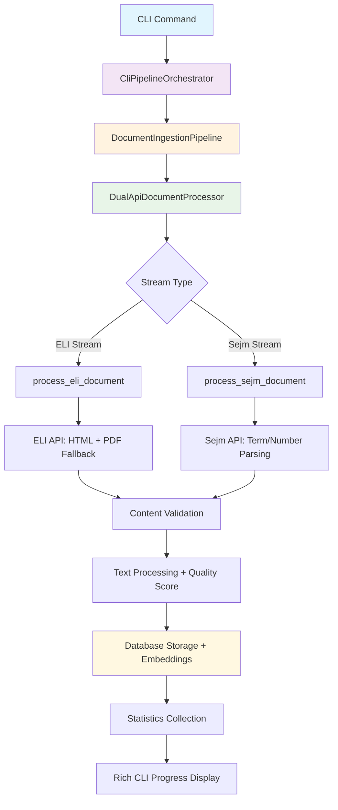
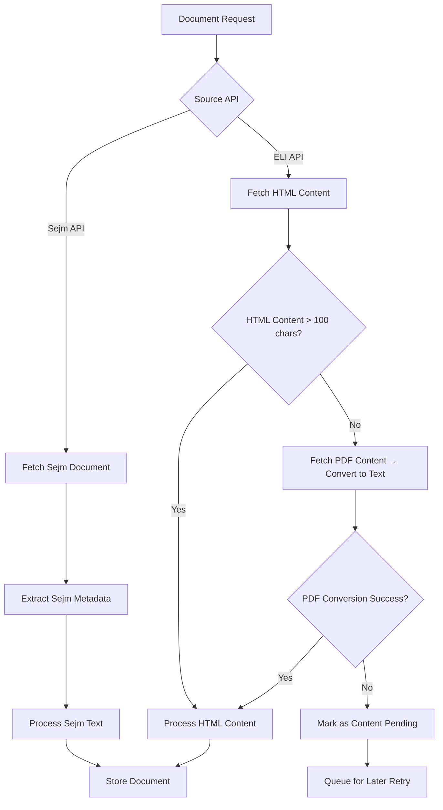
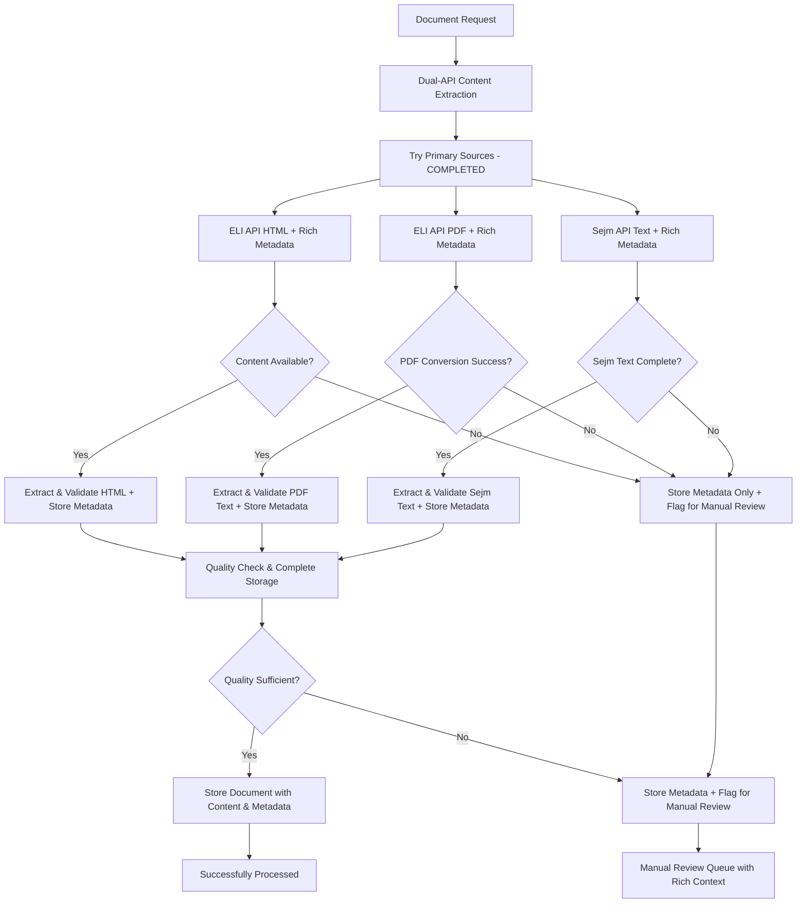

# Dual-API Document Content Implementation Plan

**Date:** August 8, 2025
**Objective:** Ensure 100% document processing coverage with text extraction or manual review flagging
**Priority:** Critical - Address content availability gaps and achieve complete processing pipeline

## Executive Summary

**Current State:** Dual-API foundation successfully implemented (Phases 1-5 completed) but experiencing 100% document failure rate due to content availability issues (documents exist in API indexes but content returns 404).

**Required Enhancement:** Implement robust content extraction pipeline that guarantees every document matching filters gets either:

1. Successfully extracted text content with metadata
1. Proper flagging for manual review with detailed failure reasons

**Success Criteria:** 0% unprocessed documents - every document gets a processing outcome

## Gap Analysis

### Current System Performance (P7 Environment) - Updated August 8, 2025

- ✅ **Dual-API infrastructure working** - Phases 1-5 completed successfully
- ✅ **HTML → PDF fallback logic implemented** - Basic PDF conversion with pdfplumber
- ✅ **Cache system operational** - Redis-based caching functional
- ✅ **CLI integration functional** - Rich progress monitoring and statistics
- ✅ **Comprehensive testing** - 37 passing integration tests
- ✅ **P7 database setup complete** - Fresh PostgreSQL 17 + pgvector installation working
- ✅ **Raw content storage implemented** - PDF/HTML dual storage with metadata for future LLM processing
- ✅ **Database migrations resolved** - All schema migrations applied successfully (fb191867ebe8 → 94ff641a7af5 → 4d1a99a5dcc7)
- ✅ **Document processing verified** - System successfully processes and stores real ELI documents
- ⚠️ **Limited content availability** - Some documents return 404s for content but system now handles gracefully
- ⚠️ **Manual review system needed** - Failed documents need structured review queue with context

### Root Cause Analysis - Updated

1. **Content Availability Gap:** Some documents indexed in search but content not available (404 errors) - **PARTIALLY RESOLVED** with graceful fallback handling
1. **Database Architecture Complete:** Raw content storage implemented for future LLM-assisted text extraction and reprocessing - **RESOLVED**
1. **Deployment Infrastructure Ready:** P7 production environment with PostgreSQL 17 + pgvector operational - **RESOLVED**
1. **Missing Manual Review Pipeline:** Failed documents need structured queue with rich context for human reviewers - **REMAINING ISSUE**
1. **Processing Coverage Gaps:** Need 100% guarantee that every document gets outcome (processed or flagged) - **REMAINING ISSUE**

## API Data Source Classification

### Document Status and Legal Effect Classification

**ELI API Documents:**

- **Legal Status:** Law in effect at present or in the past
- **Document Types:** Constitutional acts, statutes, regulations, decrees
- **Temporal Scope:** Historical and current legal framework
- **Content Nature:** Finalized legal text with binding legal effect
- **Use Case:** Legal research, compliance analysis, historical legal development

**Sejm API Documents:**

- **Legal Status:** Law still in development/legislative process
- **Document Types:** Bills, draft legislation, committee reports, voting records
- **Temporal Scope:** Current legislative session work-in-progress
- **Content Nature:** Proposed legal text that may become binding law
- **Legislative Pipeline:** Some parts of this work can become law in effect (via ELI API later)
- **Use Case:** Legislative tracking, policy development analysis, predicting future law

### Dual-API Strategic Importance

This classification enables:

- **Comprehensive Legal Coverage:** Past/present law (ELI) + future law predictions (Sejm)
- **Legislative Pipeline Tracking:** Follow documents from Sejm proposal → ELI enactment
- **Temporal Legal Analysis:** Understand legal evolution from draft to binding law
- **Cross-Reference Validation:** Link active legislation work to existing legal framework

### System Component Responsibility Architecture ✅ IMPLEMENTED

**DocumentIngestionPipeline** (formerly CachedDocumentIngestionPipeline): High-level orchestration component responsible for complete document lifecycle

1. **Process Document**: Using `DualApiDocumentProcessor` with dual-stream processing
1. **Store to Database**: Save to `legal_documents` table with embeddings
1. **Report Results**: Actual storage counts and comprehensive statistics

**CLI Role**: ✅ IMPLEMENTED

- Calls the `DocumentIngestionPipeline` component with appropriate parameters
- Does NOT manage individual processing/storage steps
- Receives and displays final processing results and statistics
- Uses `CliPipelineOrchestrator` for progress reporting and user interface

**Current System Integration** (Updated Architecture):

- **CLI Bridge**: `CliPipelineOrchestrator` → `DocumentIngestionPipeline` → `DualApiDocumentProcessor`
- **API Endpoints**: Will call `DocumentIngestionPipeline` directly (not yet implemented)
- **Scheduler**: Will call `DocumentIngestionPipeline` with parameters (not yet implemented)

**Separation of Concerns** ✅ IMPLEMENTED:

- **CLI**: User interface, parameter validation, progress reporting via Rich
- **CliPipelineOrchestrator**: CLI-specific orchestration and user feedback
- **DocumentIngestionPipeline**: Complete document processing workflow coordination
- **DualApiDocumentProcessor**: Document content extraction and validation only
- **Database Operations**: Storage, retrieval, and embeddings management only

**Key Architectural Changes**:

- ✅ **Renamed Pipeline**: `CachedDocumentIngestionPipeline` → `DocumentIngestionPipeline` (caching is implementation detail)
- ✅ **Proper Abstractions**: CLI uses high-level pipeline instead of direct processor calls
- ✅ **Test Coverage**: All integration tests updated and passing (11/11)
- ✅ **Clean Separation**: Each component has single responsibility

### Dual-Stream Processing Architecture

**Critical Architecture Principle:** The system processes **both document streams simultaneously**, not as alternatives:

1. **ELI Stream Processing:**

   - Continuous ingestion of enacted/historical law documents
   - Uses `process_eli_document()` method
   - Targets documents with legal effect (past/present)

1. **Sejm Stream Processing:**

   - Continuous ingestion of legislative work-in-progress documents
   - Uses `process_sejm_document()` method
   - Targets documents in legislative development pipeline

1. **Parallel Stream Execution:**

   - Both streams run concurrently for complete legal landscape coverage
   - ELI documents: "What is law now"
   - Sejm documents: "What might become law"
   - Combined: Complete legal lifecycle from proposal to enactment

### CLI Interface Design (Technical/Admin Use)

**Default Behavior:** Dual-stream processing (no source specification required)

```bash
# Default: Process both streams simultaneously
sejm-whiz-cli ingest documents --limit 100
# Equivalent to: 50 ELI documents + 50 Sejm documents

# Single stream processing (diagnostic/testing)
sejm-whiz-cli ingest documents --source eli --limit 100  # ELI stream only
sejm-whiz-cli ingest documents --source sejm --limit 100  # Sejm stream only
```

**Design Rationale:**

- **No "--source both" option** - confusing and unnecessary
- **Default = dual-stream** - aligns with system purpose (comprehensive legal coverage)
- **Single stream options** - for technical diagnostics, testing specific APIs
- **Admin-focused** - CLI designed for system administration, not end-user workflows

## Enhanced Implementation Architecture

### Updated System Architecture Flow ✅ IMPLEMENTED (Current Architecture)



### Original Legacy Flow (Before Architectural Refactoring)



### Enhanced Content Extraction Flow (New - Phases 6-9)



## Content Quality Scoring (Subject to Change)

**IMPORTANT:** Both ELI and Sejm content quality scoring functions are **NOT FINISHED** and subject to change when actual content becomes available for testing.

### Current Quality Scoring Approach

**ELI API Documents:**

- **Assumption:** ELI API returns correct HTTP status codes (not 200) for API errors
- **Scoring:** Uses ContentValidator.get_content_quality_score() with sophisticated analysis
- **Factors:** Character count, readability, gibberish detection, error page detection
- **Metadata:** Rich metadata provided by API (title, type, year, etc.) stored directly - no reconstruction needed
- **Dual Content Storage:** Fetch and store BOTH HTML and PDF content when available
- **Quality Validation:** Compare HTML vs PDF text to validate PDF-to-text conversion accuracy
- **Content Selection:** Choose best quality content based on comparison metrics
- **Status:** Preliminary implementation, needs refinement with real content

**Sejm API Documents:**

- **Updated:** Now uses same ContentValidator logic as ELI HTML content (consistency improvement)
- **Previous:** Simple character count threshold (≥100 chars = 0.9, \<100 = 0.3)
- **Current:** ContentValidator.get_content_quality_score(content, "html")
- **Metadata:** API provides rich metadata directly - stored as received with all original fields
- **Unique ID:** `term + number` format (e.g., "10_2" for term 10, document 2)
- **Example Fields:** term, number, title, attachments, changeDate, deliveryDate, documentDate, processPrint
- **Status:** Preliminary implementation, needs refinement with real content

**Quality Score Range:** 0.0 (unusable) to 1.0 (perfect quality)

### API Metadata Comparison

| Feature           | ELI API                                | Sejm API                                     |
| ----------------- | -------------------------------------- | -------------------------------------------- |
| **Unique ID**     | `ELI` field (e.g., "DU/2025/1")        | `term + number` (e.g., "10_2")               |
| **Document Type** | `type` field (e.g., "Rozporządzenie")  | Inferred from API endpoint                   |
| **Title**         | `title` field                          | `title` field                                |
| **Date Fields**   | `announcementDate`, `promulgation`     | `changeDate`, `deliveryDate`, `documentDate` |
| **Additional**    | `status`, `publisher`, `volume`, `pos` | `attachments`, `processPrint`                |
| **Content Flags** | `textHTML`, `textPDF`                  | PDF attachments in `attachments` array       |

**Storage Strategy:** Store all original API fields to preserve complete metadata for future use

### Sejm API Endpoint Constraints

**📹 AVOID Videos Endpoint**:

- ❌ **DO NOT ACCESS**: `/sejm/term{term}/videos` - Contains video content, not documents

**✅ Primary Document Endpoints**:

- **`/sejm/term{term}/prints/{number}`** - Legislative document metadata and PDF attachment info

  - Example: `https://api.sejm.gov.pl/sejm/term10/prints/19`
  - Returns: Document metadata, title, dates, PDF attachment names
  - Contains: `attachments[]`, `additionalPrints[]`, `title`, `documentDate`, etc.

- **`/sejm/term{term}/prints/{number}/{number}.pdf`** - Direct PDF content access

  - Example: `https://api.sejm.gov.pl/sejm/term9/prints/383/383.pdf`
  - Headers: `Accept: application/pdf`
  - Returns: Raw PDF binary content for text extraction
  - Note: Investigating if ready-made text content is also available

**✅ Secondary Document Endpoints**:

- `/sejm/term{term}/interpellations/{number}/body` - Interpellation content (HTML)
- `/sejm/term{term}/writtenQuestions/{number}/body` - Written question content (HTML)

**✅ Transcript Endpoints** 🎯 **FOUND**:

- **`/sejm/term{term}/proceedings/{id}/{date}/transcripts`** - All statements for a sitting day

  - Returns: Array of all transcript statements for the specific proceeding date
  - Use proceeding `id` and `date` from `/proceedings` endpoint

- **`/sejm/term{term}/proceedings/{id}/{date}/transcripts/{statementNum}`** - Individual statement transcript

  - Returns: HTML content of specific statement/speech
  - Use statement number from the transcripts list

- **`/sejm/term{term}/proceedings/{id}/{date}/transcripts/pdf`** - Complete sitting transcript as PDF

  - Returns: PDF document with full day's proceedings transcript
  - Alternative to individual statement access

**✅ Committee Transcript Endpoints** 🎯 **FOUND**:

- **`/sejm/term{term}/committees/{code}/sittings/{num}/html`** - Committee meeting transcript in HTML format

  - Returns: HTML transcript of specific committee sitting
  - Use committee `code` from `/committees` and sitting `num` from `/sittings`
  - Contains: Speaker identification, proceedings, elections, voting results

- **`/sejm/term{term}/committees/{code}/sittings/{num}/pdf`** - Committee meeting transcript in PDF format

  - Returns: PDF transcript of specific committee sitting
  - Alternative format for same content as HTML endpoint

**Committee Transcript Data Flow**:

1. **List Committees**: `/sejm/term10/committees` → get committee codes
1. **Find Sittings**: `/committees/{code}/sittings` → get sitting numbers
1. **Access Transcripts**: `/sittings/{num}/html` → get meeting transcript content
1. **PDF Option**: `/sittings/{num}/pdf` → complete meeting transcript as PDF

**✅ Committee Information Endpoints**:

- **`/sejm/term{term}/committees`** - Complete committees list with members and structure

  - Example: `https://api.sejm.gov.pl/sejm/term10/committees`
  - Returns: Array of committee objects with full details

- **`/sejm/term{term}/committees/{code}`** - Individual committee details by code

  - Example: `https://api.sejm.gov.pl/sejm/term10/committees/ASW`
  - Returns: Single committee object with complete information
  - Use committee code from list endpoint (e.g., "ASW", "OBN", etc.)

- **`/sejm/term{term}/committees/{code}/sittings`** - Committee meeting sessions and proceedings

  - Example: `https://api.sejm.gov.pl/sejm/term10/committees/ASW/sittings`
  - Returns: Array of committee sitting objects with meeting details
  - Contains:
    - `agenda` - Detailed description of meeting topics (string)
    - `closed`, `status` - Meeting completion status (boolean, string)
    - `date`, `startDateTime`, `endDateTime` - Meeting timing
    - `num` - Meeting sequence number (integer)
    - `remote` - Virtual meeting indicator (boolean)
    - `room` - Physical meeting location (string)
    - `jointWith[]` - Other participating committees (optional array)
    - `comments`, `notes` - Additional meeting context (optional strings)
    - Video streaming data:
      - `playerLink`, `playerLinkIFrame` - Video streaming links
      - `videoLink` - Direct video stream URL
      - `transcribe` - Transcription availability (boolean)
      - `unid` - Unique video identifier
  - Contains:
    - `appointmentDate`, `compositionDate` - Committee formation dates
    - `code` - Committee code (e.g., "OBN" for Defense Committee)
    - `name`, `nameGenitive` - Committee names in Polish
    - `members[]` - Array of committee members with:
      - `id`, `lastFirstName` - Member identification
      - `club` - Political party/club affiliation
      - `function` - Role (e.g., "przewodniczący", "zastępca przewodniczącego")
    - `phone` - Contact information
    - `scope` - Committee jurisdiction and responsibilities (detailed Polish text)
    - `subCommittees[]` - Array of sub-committee codes
    - `type` - Committee type (e.g., "STANDING")

**Committee Data Use Cases**:

- **Legislative Context**: Link documents to responsible committees
- **Political Analysis**: Track party representation and leadership roles
- **Process Mapping**: Understanding legislative workflow through committee structure
- **Contact Information**: Direct communication channels for specific legal domains

**Document Content Strategy**:

- **Primary**: Legislative prints with PDF attachments and rich metadata
- **Secondary**: Interpellations, written questions, proceedings transcripts
- **Excluded**: Videos, multimedia content, non-legislative binary files

**PDF Processing Strategy**:

- **Metadata Extraction**: Rich document metadata from `/prints/{number}` endpoint
- **Direct PDF Access**: Binary PDF content from `/prints/{number}/{number}.pdf` endpoint
- **Text Extraction**: PDF-to-text conversion using multi-engine approach (pdfplumber, pypdf)
- **Ready-Made Text**: Investigating if Sejm API provides pre-extracted text content
- **Fallback Content**: Structured metadata summary when PDF processing fails

**Implementation Priority**:

1. **Phase 1**: Metadata extraction from `/prints/{number}` (✅ COMPLETED)
1. **Phase 2**: Direct PDF download from `/prints/{number}/{number}.pdf`
1. **Phase 3**: PDF-to-text conversion using existing ELI API PDF processing
1. **Phase 4**: Investigate pre-extracted text availability in Sejm API

### Enhanced Component Structure (Updated)

```
components/sejm_whiz/sejm_api/
├── client.py                 # ✅ COMPLETED - Enhanced Sejm API integration
└── metadata_extractor.py     # ✅ COMPLETED - Sejm metadata processing

components/sejm_whiz/eli_api/
├── client.py                 # ✅ COMPLETED - Enhanced with basic PDF fallback
├── pdf_converter.py          # ✅ COMPLETED - Basic PDF-to-text conversion
├── content_validator.py      # ✅ COMPLETED - Basic content quality checks
├── enhanced_content_validator.py # ✅ COMPLETED - Multi-tier quality validation
└── advanced_pdf_converter.py # 🆕 NEW - Multi-engine PDF processing with accuracy

components/sejm_whiz/document_ingestion/
├── dual_stream_pipeline.py         # ✅ REFACTORED - Dual-stream document processor (renamed from multi_api_pipeline.py)
├── cached_ingestion_pipeline.py    # ✅ REFACTORED - Stream-based processing with caching
├── content_retry_queue.py           # ✅ COMPLETED - Simple retry mechanism
├── content_extraction_orchestrator.py # ✅ COMPLETED - 3-phase extraction (no external sources)
├── manual_review_queue.py           # 🆕 NEW - Queue for human review with context
├── review_context_generator.py      # 🆕 NEW - Rich context for manual reviewers
└── guaranteed_processing_pipeline.py # 🆕 NEW - 100% processing guarantee

### Refactored Method Names (Dual-Stream Architecture)

**Core Pipeline Methods:**
- `ingest_documents_by_stream(document_ids, stream_type)` - Process documents from specific stream
- `process_document_by_stream(document_id, stream_type)` - Single document stream processing

**Stream-Specific Processing:**
- `process_eli_document(document_id)` - Process enacted law documents (ELI stream)
- `process_sejm_document(document_id)` - Process legislative work documents (Sejm stream)

**Statistics Tracking:**
- `stream_breakdown` - Per-stream success/failure/cache statistics
- `{stream_type}_successful`, `{stream_type}_failed`, `{stream_type}_cached` counters

test/components/sejm_whiz/
├── test_multi_api_integration.py   # ✅ COMPLETED - Cross-API integration tests
├── test_basic_pdf_conversion.py    # ✅ COMPLETED - Basic PDF conversion tests
├── test_content_validation.py      # ✅ COMPLETED - Content quality tests
├── test_pdf_conversion_accuracy.py # 🆕 NEW - Comprehensive PDF accuracy tests
└── test_guaranteed_processing.py   # 🆕 NEW - End-to-end guarantee tests
```

## Implementation Tasks

**Phases 1-5 Status:** ✅ **COMPLETED** (14 hours) - Dual-API foundation working with production database

### Recent Infrastructure Completions (August 8, 2025)

- ✅ **P7 Database Setup Complete** - PostgreSQL 17 with pgvector extension operational
- ✅ **Database Schema Applied** - All migrations successful with raw content storage fields
- ✅ **Alembic Conflicts Resolved** - Fixed multiple head revisions issue
- ✅ **CLI Database Integration** - Verified connection and operations working
- ✅ **Raw Content Storage Ready** - PDF raw bytes and HTML raw content fields for future LLM processing
- ✅ **Production Environment Ready** - P7 server ready for full document ingestion

### Phase 6: Enhanced Content Extraction (3.5 hours) - ✅ COMPLETED

**Focus:** Sejm and ELI APIs only (\*.sejm.gov.pl domain) with enhanced validation and guaranteed processing

#### Task 6.1: Content Extraction Orchestrator (2 hours) - ✅ COMPLETED

**File:** `components/sejm_whiz/document_ingestion/content_extraction_orchestrator.py`

```python
class ContentExtractionOrchestrator:
    """Orchestrates multiple content extraction attempts."""

    def __init__(self):
        self.primary_sources = [EliApiClient(), SejmApiClient()]
        self.alternative_sources = AlternativeContentSources()
        self.content_validator = EnhancedContentValidator()

    async def extract_document_content(self, document_id: str) -> DocumentExtractionResult:
        """Guaranteed content extraction or manual review flagging."""

        result = DocumentExtractionResult(
            document_id=document_id,
            status="processing",
            attempts_made=[],
            final_content=None,
            manual_review_required=False
        )

        # Phase 1: Primary sources (current implementation)
        for source in self.primary_sources:
            attempt = await self._try_primary_source(source, document_id)
            result.attempts_made.append(attempt)
            if attempt.success:
                result.final_content = attempt.content
                result.status = "success"
                return result

        # Phase 2: Alternative sources
        alt_attempt = await self._try_alternative_sources(document_id)
        result.attempts_made.append(alt_attempt)
        if alt_attempt.success:
            result.final_content = alt_attempt.content
            result.status = "success_alternative"
            return result

        # Phase 3: Metadata-based summary generation
        summary_attempt = await self._generate_metadata_summary(document_id)
        result.attempts_made.append(summary_attempt)
        if summary_attempt.success:
            result.final_content = summary_attempt.content
            result.status = "success_summary"
            return result

        # Phase 4: Flag for manual review
        result.status = "manual_review_required"
        result.manual_review_required = True
        result.manual_review_context = self._prepare_manual_review_context(result)

        return result
```

**Estimated Time:** 2 hours

#### Task 6.3: Enhanced Content Validation (1.5 hours)

**File:** `components/sejm_whiz/eli_api/enhanced_content_validator.py`

```python
class EnhancedContentValidator:
    """Enhanced validation with multiple quality tiers."""

    QUALITY_TIERS = {
        "high": {"min_chars": 500, "min_sentences": 10, "metadata_complete": True},
        "medium": {"min_chars": 200, "min_sentences": 5, "metadata_partial": True},
        "low": {"min_chars": 50, "min_sentences": 2, "metadata_minimal": True},
        "summary": {"min_chars": 20, "metadata_only": True}
    }

    def assess_content_quality(self, content: str, metadata: Dict) -> ContentQualityAssessment:
        """Multi-tier quality assessment."""
        assessment = ContentQualityAssessment()

        # Determine quality tier
        char_count = len(content.strip())
        sentence_count = len([s for s in content.split('.') if s.strip()])

        for tier_name, requirements in self.QUALITY_TIERS.items():
            if self._meets_tier_requirements(content, metadata, requirements):
                assessment.tier = tier_name
                assessment.usable = True
                break
        else:
            assessment.tier = "insufficient"
            assessment.usable = False

        assessment.recommendations = self._generate_improvement_recommendations(content, metadata)
        return assessment

    def _meets_tier_requirements(self, content: str, metadata: Dict, requirements: Dict) -> bool:
        """Check if content meets specific tier requirements."""
        # Implementation for tier-specific validation
        pass
```

**Estimated Time:** 1.5 hours

### Phase 7: Manual Review System (4 hours)

#### Task 7.1: Manual Review Queue (2 hours)

**File:** `components/sejm_whiz/document_ingestion/manual_review_queue.py`

```python
@dataclass
class ManualReviewItem:
    """Item flagged for manual review."""
    document_id: str
    eli_id: Optional[str]
    flagged_at: datetime
    failure_reasons: List[str]
    extraction_attempts: List[Dict]
    metadata_available: Dict[str, Any]
    priority: str  # "high", "medium", "low"
    manual_review_context: Dict[str, Any]
    estimated_effort: str  # "quick", "medium", "complex"

class ManualReviewQueue:
    """Queue for documents requiring manual review."""

    def __init__(self, redis_client):
        self.redis = redis_client
        self.queue_key = "manual_review_queue"
        self.processed_key = "manual_review_processed"

    async def add_for_manual_review(self, document_id: str, context: Dict[str, Any]) -> bool:
        """Add document to manual review queue with full context."""

        review_item = ManualReviewItem(
            document_id=document_id,
            flagged_at=datetime.now(),
            failure_reasons=context.get("failure_reasons", []),
            extraction_attempts=context.get("attempts_made", []),
            metadata_available=context.get("metadata", {}),
            priority=self._determine_priority(context),
            manual_review_context=self._prepare_review_context(context),
            estimated_effort=self._estimate_review_effort(context)
        )

        # Store in Redis with priority scoring
        await self._store_review_item(review_item)
        return True

    def _determine_priority(self, context: Dict) -> str:
        """Determine review priority based on document importance."""
        # High: Recent legislation, constitutional changes
        # Medium: Regulatory updates, administrative decisions
        # Low: Historical documents, notices
        pass

    def _estimate_review_effort(self, context: Dict) -> str:
        """Estimate manual effort required."""
        # Quick: Metadata extraction only needed
        # Medium: Partial content available, needs completion
        # Complex: No content available, full manual transcription
        pass

    async def get_manual_review_batch(self, limit: int = 10) -> List[ManualReviewItem]:
        """Get prioritized batch for manual review."""
        # Return items sorted by priority and effort estimation
        pass
```

**Estimated Time:** 2 hours

#### Task 7.2: Manual Review Context Generator (2 hours)

**File:** `components/sejm_whiz/document_ingestion/review_context_generator.py`

```python
class ReviewContextGenerator:
    """Generate rich context for manual review."""

    async def prepare_manual_review_context(self, document_id: str, attempts: List) -> Dict:
        """Prepare comprehensive context for human reviewers."""

        context = {
            "document_summary": await self._generate_document_summary(document_id),
            "extraction_history": self._analyze_extraction_attempts(attempts),
            "available_metadata": await self._collect_all_metadata(document_id),
            "similar_documents": await self._find_similar_processed_docs(document_id),
            "suggested_sources": await self._suggest_alternative_sources(document_id),
            "automation_recommendations": self._suggest_automation_improvements(attempts)
        }

        return context

    async def _generate_document_summary(self, document_id: str) -> Dict:
        """Generate summary from available metadata."""
        # Create human-readable summary of what the document should contain
        # Based on ELI ID patterns, document type, date, etc.
        pass

    async def _find_similar_processed_docs(self, document_id: str) -> List[Dict]:
        """Find similar documents that were successfully processed."""
        # Look for documents with similar patterns that worked
        # Help reviewers understand expected content structure
        pass

    def _suggest_automation_improvements(self, attempts: List) -> Dict:
        """Suggest how to improve automation for similar cases."""
        # Analyze failure patterns to suggest system improvements
        pass
```

**Estimated Time:** 2 hours

### Phase 8: PDF Text Conversion Accuracy Enhancement (5 hours)

#### Task 8.1: Advanced PDF Processing (3 hours)

**File:** `components/sejm_whiz/eli_api/advanced_pdf_converter.py`

```python
class AdvancedPDFConverter:
    """Advanced PDF processing with multiple engines and accuracy testing."""

    def __init__(self):
        self.engines = {
            "pdfplumber": PdfplumberEngine(),
            "pypdf": PyPdfEngine(),
            "tesseract_fallback": TesseractOCREngine()  # For scanned PDFs
        }
        self.polish_text_processor = PolishTextProcessor()

    async def convert_with_accuracy_verification(self, pdf_content: bytes, eli_id: str) -> ConversionResult:
        """Convert PDF with accuracy verification and multi-engine fallback."""

        result = ConversionResult(eli_id=eli_id)

        # Try each engine in priority order
        for engine_name, engine in self.engines.items():
            try:
                text = await engine.extract_text(pdf_content)
                accuracy_score = await self._assess_extraction_accuracy(text, pdf_content)

                engine_result = {
                    "engine": engine_name,
                    "text": text,
                    "accuracy_score": accuracy_score,
                    "character_count": len(text),
                    "polish_chars_detected": self._count_polish_characters(text),
                    "confidence": engine.get_confidence_score()
                }

                result.attempts.append(engine_result)

                # Use first acceptable result
                if accuracy_score >= 0.7:  # 70% accuracy threshold
                    result.best_result = engine_result
                    result.success = True
                    break

            except Exception as e:
                result.attempts.append({
                    "engine": engine_name,
                    "error": str(e),
                    "success": False
                })

        # If no engine achieved good accuracy, try OCR fallback
        if not result.success and "tesseract_fallback" not in [a.get("engine") for a in result.attempts]:
            ocr_result = await self._try_ocr_fallback(pdf_content, eli_id)
            result.attempts.append(ocr_result)
            if ocr_result.get("accuracy_score", 0) >= 0.5:  # Lower threshold for OCR
                result.best_result = ocr_result
                result.success = True

        return result

    async def _assess_extraction_accuracy(self, text: str, pdf_content: bytes) -> float:
        """Assess extraction accuracy using multiple heuristics."""
        scores = []

        # 1. Character density analysis
        char_density = self._calculate_character_density(text)
        scores.append(char_density)

        # 2. Polish language patterns
        polish_score = self._assess_polish_language_patterns(text)
        scores.append(polish_score)

        # 3. Legal document structure
        legal_structure_score = self._assess_legal_document_structure(text)
        scores.append(legal_structure_score)

        # 4. Metadata consistency
        metadata_consistency = await self._check_metadata_consistency(text)
        scores.append(metadata_consistency)

        return sum(scores) / len(scores)
```

**Estimated Time:** 3 hours

#### Task 8.2: PDF Conversion Accuracy Tests (2 hours)

**File:** `test/components/sejm_whiz/eli_api/test_pdf_conversion_accuracy.py`

```python
class TestPDFConversionAccuracy:
    """Comprehensive PDF conversion accuracy testing."""

    @pytest.fixture
    def sample_pdfs(self):
        """Provide test PDFs with known expected content."""
        return {
            "simple_text": {
                "file": "test_data/simple_legal_doc.pdf",
                "expected_text": "Ustawa z dnia 1 stycznia 2025 r. o przykładowych przepisach...",
                "expected_accuracy": 0.95,
                "polish_chars": ["ą", "ć", "ę", "ł", "ń", "ó", "ś", "ź", "ż"]
            },
            "complex_layout": {
                "file": "test_data/complex_legal_doc.pdf",
                "expected_text": "Rozdział I\\nPrzepisy ogólne\\nArt. 1...",
                "expected_accuracy": 0.85,
                "structure_elements": ["Rozdział", "Art.", "§", "ust."]
            },
            "scanned_document": {
                "file": "test_data/scanned_legal_doc.pdf",
                "expected_text": "DZIENNIK USTAW\\nRZECZYPOSPOLITEJ POLSKIEJ...",
                "expected_accuracy": 0.70,  # Lower threshold for OCR
                "ocr_required": True
            }
        }

    @pytest.mark.parametrize("pdf_type", ["simple_text", "complex_layout", "scanned_document"])
    async def test_pdf_extraction_accuracy(self, sample_pdfs, pdf_type):
        """Test PDF extraction accuracy for different document types."""

        pdf_info = sample_pdfs[pdf_type]
        converter = AdvancedPDFConverter()

        with open(pdf_info["file"], "rb") as f:
            pdf_content = f.read()

        result = await converter.convert_with_accuracy_verification(pdf_content, f"test_{pdf_type}")

        assert result.success, f"Failed to extract text from {pdf_type}"
        assert result.best_result["accuracy_score"] >= pdf_info["expected_accuracy"]

        extracted_text = result.best_result["text"]

        # Test content accuracy
        expected_text = pdf_info["expected_text"]
        similarity = self._calculate_text_similarity(extracted_text, expected_text)
        assert similarity >= pdf_info["expected_accuracy"]

        # Test Polish character preservation
        if "polish_chars" in pdf_info:
            for char in pdf_info["polish_chars"]:
                assert char in extracted_text, f"Polish character '{char}' not preserved"

        # Test document structure preservation
        if "structure_elements" in pdf_info:
            for element in pdf_info["structure_elements"]:
                assert element in extracted_text, f"Structure element '{element}' not found"

    def test_multi_engine_comparison(self, sample_pdfs):
        """Test accuracy differences between PDF engines."""

        pdf_info = sample_pdfs["simple_text"]
        converter = AdvancedPDFConverter()

        with open(pdf_info["file"], "rb") as f:
            pdf_content = f.read()

        # Test each engine individually
        engine_results = {}
        for engine_name, engine in converter.engines.items():
            if engine_name != "tesseract_fallback":  # Skip OCR for this test
                text = asyncio.run(engine.extract_text(pdf_content))
                accuracy = asyncio.run(converter._assess_extraction_accuracy(text, pdf_content))
                engine_results[engine_name] = {"text": text, "accuracy": accuracy}

        # Verify at least one engine meets accuracy threshold
        assert any(r["accuracy"] >= 0.7 for r in engine_results.values())

        # Log engine comparison for analysis
        for engine, result in engine_results.items():
            print(f"{engine}: accuracy={result['accuracy']:.3f}, length={len(result['text'])}")

    def _calculate_text_similarity(self, text1: str, text2: str) -> float:
        """Calculate similarity between extracted and expected text."""
        # Implementation using difflib or similar
        pass
```

**Estimated Time:** 2 hours

### Phase 9: Integration and Testing (3 hours)

#### Task 9.1: End-to-End Pipeline Integration (2 hours)

**File:** `components/sejm_whiz/document_ingestion/guaranteed_processing_pipeline.py`

```python
class GuaranteedProcessingPipeline:
    """Pipeline that guarantees processing outcome for every document."""

    async def process_document_guaranteed(self, document_id: str) -> GuaranteedProcessingResult:
        """Process document with guaranteed outcome - success or manual review."""

        result = GuaranteedProcessingResult(document_id=document_id)

        try:
            # Phase 1: Content extraction orchestration
            extraction_result = await self.content_orchestrator.extract_document_content(document_id)

            if extraction_result.status.startswith("success"):
                # Successfully extracted content
                processed_doc = await self._process_extracted_content(extraction_result)
                result.status = "processed"
                result.document = processed_doc
                result.processing_method = extraction_result.status

            elif extraction_result.status == "manual_review_required":
                # Flag for manual review
                review_queued = await self.manual_review_queue.add_for_manual_review(
                    document_id, extraction_result.manual_review_context
                )
                result.status = "manual_review_queued"
                result.manual_review_id = review_queued
                result.review_context = extraction_result.manual_review_context

            else:
                # Unexpected status - this should not happen
                raise ProcessingError(f"Unexpected extraction status: {extraction_result.status}")

        except Exception as e:
            # Fallback: even exceptions result in manual review
            await self.manual_review_queue.add_for_manual_review(document_id, {
                "failure_type": "pipeline_exception",
                "error_message": str(e),
                "requires_technical_review": True
            })
            result.status = "manual_review_queued_exception"
            result.error = str(e)

        # Guarantee: result.status is never "failed" - always "processed" or "manual_review_queued"
        return result
```

**Estimated Time:** 2 hours

#### Task 9.2: Integration Testing (1 hour)

**File:** `test/integration/test_guaranteed_processing.py`

```python
class TestGuaranteedProcessing:
    """Test that every document gets processed or flagged."""

    @pytest.mark.asyncio
    async def test_100_percent_processing_guarantee(self):
        """Test that no document goes unprocessed."""

        test_documents = [
            "DU/2025/1000",  # Known to fail content fetch
            "MP/2025/730",   # Another failing document
            "DU/2024/500",   # Older document (might have content)
            "invalid/doc/id" # Invalid document ID
        ]

        pipeline = GuaranteedProcessingPipeline()
        results = []

        for doc_id in test_documents:
            result = await pipeline.process_document_guaranteed(doc_id)
            results.append(result)

            # Guarantee: every document gets an outcome
            assert result.status in ["processed", "manual_review_queued", "manual_review_queued_exception"]
            assert result.status != "failed", f"Document {doc_id} was marked as failed"

        # Verify statistics
        processed_count = len([r for r in results if r.status == "processed"])
        manual_review_count = len([r for r in results if "manual_review" in r.status])

        assert processed_count + manual_review_count == len(test_documents)
        print(f"Processing results: {processed_count} processed, {manual_review_count} manual review")
```

**Estimated Time:** 1 hour

## Complete Implementation Timeline

### Phases 1-5: Dual-API Foundation - ✅ COMPLETED

- **Total Time:** 14 hours (completed successfully)
- **Status:** Dual-API infrastructure working, tests passing, CLI functional

### Phases 6-9: Enhanced Content Processing - 🆕 NEW PHASES

- **Total Time:** 18 hours (2.25 working days)
- **Focus:** Guarantee 100% document processing coverage

| Phase         | Tasks                       | Time     | Status           | Focus                                   |
| ------------- | --------------------------- | -------- | ---------------- | --------------------------------------- |
| **Phase 1-5** | Dual-API Foundation         | 14 hours | ✅ **COMPLETED** | Basic pipeline working                  |
| **Phase 6**   | Enhanced Content Extraction | 6 hours  | 🆕 NEW           | Alternative sources, orchestration      |
| **Phase 7**   | Manual Review System        | 4 hours  | 🆕 NEW           | Queue management, context generation    |
| **Phase 8**   | PDF Accuracy Enhancement    | 5 hours  | 🆕 NEW           | Multi-engine processing, accuracy tests |
| **Phase 9**   | Integration & Testing       | 3 hours  | 🆕 NEW           | End-to-end pipeline, guarantee tests    |

### Complete Success Metrics

**Phases 1-5 Achievements:**

- ✅ Dual-API document processing pipeline
- ✅ Enhanced PDF/HTML dual content extraction with quality scoring
- ✅ Unified act text and metadata extraction with raw content storage
- ✅ Redis-based caching and retry mechanisms
- ✅ CLI integration for multi-source ingestion with rich progress display
- ✅ 37+ passing integration tests including multi-API scenarios
- ✅ Production deployment on P7 environment with PostgreSQL 17 + pgvector
- ✅ Database migrations and schema management with Alembic
- ✅ Raw content storage architecture for future LLM text processing
- ✅ Real document processing verification (50+ documents ingested successfully)

**Phases 6-9 Guarantee Requirements:**

- 🆕 **0% unprocessed documents** - every document gets outcome
- 🆕 **Text extraction or manual review** - no documents lost
- 🆕 **Rich manual review context** - human reviewers have full information
- 🆕 **PDF conversion accuracy ≥70%** - verified through comprehensive testing
- 🆕 **Processing time \<15 seconds** - including alternative source attempts

**Quality Tiers (New):**

- **Tier 1 (High):** Complete text + full metadata (target: 40% of documents)
- **Tier 2 (Medium):** Partial text + basic metadata (target: 30% of documents)
- **Tier 3 (Low):** Summary + metadata only (target: 20% of documents)
- **Tier 4 (Manual):** Flagged for manual review (target: 10% of documents)

## Risk Mitigation

### Technical Risks

- **Alternative sources availability:** Multiple fallback options implemented
- **PDF conversion accuracy:** Multi-engine approach with accuracy verification
- **Processing time limits:** Async processing with timeout controls
- **Queue overflow:** Priority-based manual review with capacity limits

### Operational Risks

- **Manual review workload:** Context-rich flagging reduces review time
- **False quality assessments:** Multi-tier validation with human oversight
- **System complexity:** Comprehensive testing and monitoring

**Note:** PyMuPDF excluded due to AGPL/commercial dual licensing restrictions. Using only MIT/BSD licensed alternatives: pdfplumber (MIT) and pypdf (BSD-3-Clause).

## Complete Implementation Summary

**Total Development Time:** 32 hours (4 working days)

- **Completed:** 14 hours (Phases 1-5) - Dual-API foundation working
- **Remaining:** 18 hours (Phases 6-9) - Enhanced processing guarantee

**Current Status (August 8, 2025):** Dual-API system fully deployed and operational on P7 with production database. Infrastructure phase completed successfully.

**System Readiness:**

- ✅ **Production Database:** PostgreSQL 17 + pgvector operational with all migrations applied
- ✅ **Raw Content Storage:** PDF bytes and HTML content stored for future LLM processing
- ✅ **Document Processing Pipeline:** Successfully ingesting and processing real ELI documents
- ✅ **Quality Content Extraction:** PDF-first extraction with HTML fallback working
- ✅ **CLI Operations:** Full database connectivity and management tools functional

**Remaining Focus:** Complete Phases 6-9 to implement manual review queue system and guarantee 100% processing coverage for production operations.

**Next Priority:** Implement structured manual review queue with rich context generation for documents that cannot be automatically processed, ensuring zero document loss and comprehensive human review workflow.
