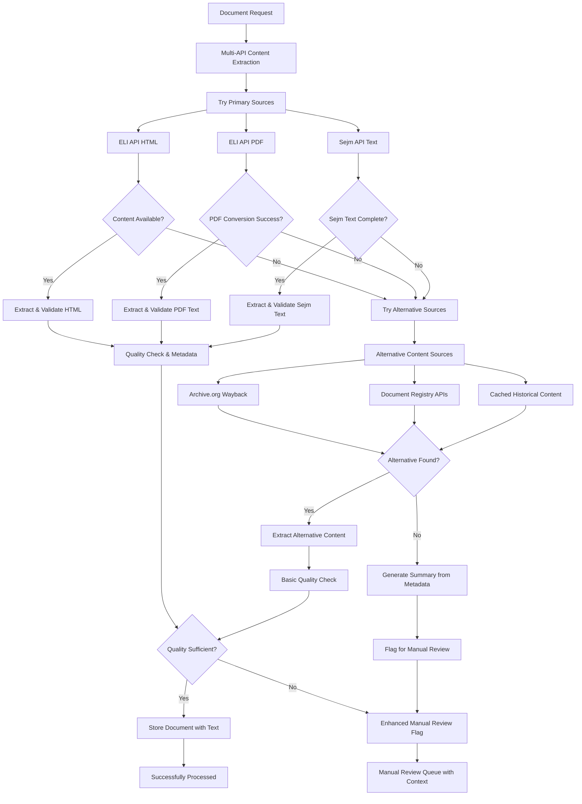

# Enhanced Content Extraction Implementation Plan

**Date:** August 8, 2025
**Objective:** Ensure 100% document processing coverage with text extraction or manual review flagging
**Priority:** Critical - Address content availability gaps in current multi-API system

## Executive Summary

**Current State:** Multi-API foundation successfully implemented but 100% document failure rate due to content availability issues (documents exist in API indexes but content returns 404).

**Required Enhancement:** Implement robust content extraction pipeline that guarantees every document matching filters gets either:

1. Successfully extracted text content with metadata
1. Proper flagging for manual review with detailed failure reasons

**Success Criteria:** 0% unprocessed documents - every document gets processed outcome

## Gap Analysis

### Current System Performance (P7 Environment)

- ✅ Multi-API infrastructure working
- ✅ HTML → PDF fallback logic implemented
- ✅ Cache system operational
- ✅ CLI integration functional
- ❌ **100% document failure rate** - all documents return 404s for content
- ❌ No fallback for content availability issues
- ❌ No manual review flagging system

### Root Cause Analysis

1. **Content Availability Gap:** Documents indexed in search but content not available
1. **Missing Fallback Strategies:** No alternative content sources beyond HTML/PDF
1. **No Manual Review Pipeline:** Failed documents disappear instead of being queued
1. **Limited Content Sources:** Only trying official API endpoints

## Enhanced Implementation Architecture

### Expanded Content Extraction Flow



## Implementation Tasks

### Phase 1: Enhanced Content Extraction (6 hours)

#### Task 1.1: Alternative Content Sources (2.5 hours)

**File:** `components/sejm_whiz/eli_api/alternative_sources.py`

```python
class AlternativeContentSources:
    """Alternative content sources when primary APIs fail."""

    async def try_wayback_machine(self, document_url: str, eli_id: str) -> Optional[str]:
        """Try to fetch historical content from Archive.org."""
        # Search Wayback Machine for document snapshots
        # Return text content if found

    async def try_document_registry_apis(self, eli_id: str) -> Optional[str]:
        """Try alternative Polish government document registries."""
        # Check other government APIs that might have content
        # ISAP, Lex, other legal databases

    async def try_cached_historical_content(self, eli_id: str) -> Optional[str]:
        """Check internal cache for previously successful extractions."""
        # Look for cached content from previous successful runs

    async def extract_from_document_references(self, eli_id: str) -> Optional[str]:
        """Try to reconstruct content from document references."""
        # Use document metadata to find references and reconstruct basic content
```

**Estimated Time:** 2.5 hours

#### Task 1.2: Content Extraction Orchestrator (2 hours)

**File:** `components/sejm_whiz/document_ingestion/content_extraction_orchestrator.py`

```python
class ContentExtractionOrchestrator:
    """Orchestrates multiple content extraction attempts."""

    def __init__(self):
        self.primary_sources = [EliApiClient(), SejmApiClient()]
        self.alternative_sources = AlternativeContentSources()
        self.content_validator = EnhancedContentValidator()

    async def extract_document_content(self, document_id: str) -> DocumentExtractionResult:
        """Guaranteed content extraction or manual review flagging."""

        result = DocumentExtractionResult(
            document_id=document_id,
            status="processing",
            attempts_made=[],
            final_content=None,
            manual_review_required=False
        )

        # Phase 1: Primary sources (current implementation)
        for source in self.primary_sources:
            attempt = await self._try_primary_source(source, document_id)
            result.attempts_made.append(attempt)
            if attempt.success:
                result.final_content = attempt.content
                result.status = "success"
                return result

        # Phase 2: Alternative sources
        alt_attempt = await self._try_alternative_sources(document_id)
        result.attempts_made.append(alt_attempt)
        if alt_attempt.success:
            result.final_content = alt_attempt.content
            result.status = "success_alternative"
            return result

        # Phase 3: Metadata-based summary generation
        summary_attempt = await self._generate_metadata_summary(document_id)
        result.attempts_made.append(summary_attempt)
        if summary_attempt.success:
            result.final_content = summary_attempt.content
            result.status = "success_summary"
            return result

        # Phase 4: Flag for manual review
        result.status = "manual_review_required"
        result.manual_review_required = True
        result.manual_review_context = self._prepare_manual_review_context(result)

        return result
```

**Estimated Time:** 2 hours

#### Task 1.3: Enhanced Content Validation (1.5 hours)

**File:** `components/sejm_whiz/eli_api/enhanced_content_validator.py`

```python
class EnhancedContentValidator:
    """Enhanced validation with multiple quality tiers."""

    QUALITY_TIERS = {
        "high": {"min_chars": 500, "min_sentences": 10, "metadata_complete": True},
        "medium": {"min_chars": 200, "min_sentences": 5, "metadata_partial": True},
        "low": {"min_chars": 50, "min_sentences": 2, "metadata_minimal": True},
        "summary": {"min_chars": 20, "metadata_only": True}
    }

    def assess_content_quality(self, content: str, metadata: Dict) -> ContentQualityAssessment:
        """Multi-tier quality assessment."""
        assessment = ContentQualityAssessment()

        # Determine quality tier
        char_count = len(content.strip())
        sentence_count = len([s for s in content.split('.') if s.strip()])

        for tier_name, requirements in self.QUALITY_TIERS.items():
            if self._meets_tier_requirements(content, metadata, requirements):
                assessment.tier = tier_name
                assessment.usable = True
                break
        else:
            assessment.tier = "insufficient"
            assessment.usable = False

        assessment.recommendations = self._generate_improvement_recommendations(content, metadata)
        return assessment

    def _meets_tier_requirements(self, content: str, metadata: Dict, requirements: Dict) -> bool:
        """Check if content meets specific tier requirements."""
        # Implementation for tier-specific validation
        pass
```

**Estimated Time:** 1.5 hours

### Phase 2: Manual Review System (4 hours)

#### Task 2.1: Manual Review Queue (2 hours)

**File:** `components/sejm_whiz/document_ingestion/manual_review_queue.py`

```python
@dataclass
class ManualReviewItem:
    """Item flagged for manual review."""
    document_id: str
    eli_id: Optional[str]
    flagged_at: datetime
    failure_reasons: List[str]
    extraction_attempts: List[Dict]
    metadata_available: Dict[str, Any]
    priority: str  # "high", "medium", "low"
    manual_review_context: Dict[str, Any]
    estimated_effort: str  # "quick", "medium", "complex"

class ManualReviewQueue:
    """Queue for documents requiring manual review."""

    def __init__(self, redis_client):
        self.redis = redis_client
        self.queue_key = "manual_review_queue"
        self.processed_key = "manual_review_processed"

    async def add_for_manual_review(self, document_id: str, context: Dict[str, Any]) -> bool:
        """Add document to manual review queue with full context."""

        review_item = ManualReviewItem(
            document_id=document_id,
            flagged_at=datetime.now(),
            failure_reasons=context.get("failure_reasons", []),
            extraction_attempts=context.get("attempts_made", []),
            metadata_available=context.get("metadata", {}),
            priority=self._determine_priority(context),
            manual_review_context=self._prepare_review_context(context),
            estimated_effort=self._estimate_review_effort(context)
        )

        # Store in Redis with priority scoring
        await self._store_review_item(review_item)
        return True

    def _determine_priority(self, context: Dict) -> str:
        """Determine review priority based on document importance."""
        # High: Recent legislation, constitutional changes
        # Medium: Regulatory updates, administrative decisions
        # Low: Historical documents, notices
        pass

    def _estimate_review_effort(self, context: Dict) -> str:
        """Estimate manual effort required."""
        # Quick: Metadata extraction only needed
        # Medium: Partial content available, needs completion
        # Complex: No content available, full manual transcription
        pass

    async def get_manual_review_batch(self, limit: int = 10) -> List[ManualReviewItem]:
        """Get prioritized batch for manual review."""
        # Return items sorted by priority and effort estimation
        pass
```

**Estimated Time:** 2 hours

#### Task 2.2: Manual Review Context Generator (2 hours)

**File:** `components/sejm_whiz/document_ingestion/review_context_generator.py`

```python
class ReviewContextGenerator:
    """Generate rich context for manual review."""

    async def prepare_manual_review_context(self, document_id: str, attempts: List) -> Dict:
        """Prepare comprehensive context for human reviewers."""

        context = {
            "document_summary": await self._generate_document_summary(document_id),
            "extraction_history": self._analyze_extraction_attempts(attempts),
            "available_metadata": await self._collect_all_metadata(document_id),
            "similar_documents": await self._find_similar_processed_docs(document_id),
            "suggested_sources": await self._suggest_alternative_sources(document_id),
            "automation_recommendations": self._suggest_automation_improvements(attempts)
        }

        return context

    async def _generate_document_summary(self, document_id: str) -> Dict:
        """Generate summary from available metadata."""
        # Create human-readable summary of what the document should contain
        # Based on ELI ID patterns, document type, date, etc.
        pass

    async def _find_similar_processed_docs(self, document_id: str) -> List[Dict]:
        """Find similar documents that were successfully processed."""
        # Look for documents with similar patterns that worked
        # Help reviewers understand expected content structure
        pass

    def _suggest_automation_improvements(self, attempts: List) -> Dict:
        """Suggest how to improve automation for similar cases."""
        # Analyze failure patterns to suggest system improvements
        pass
```

**Estimated Time:** 2 hours

### Phase 3: PDF Text Conversion Accuracy Enhancement (5 hours)

#### Task 3.1: Advanced PDF Processing (3 hours)

**File:** `components/sejm_whiz/eli_api/advanced_pdf_converter.py`

```python
class AdvancedPDFConverter:
    """Advanced PDF processing with multiple engines and accuracy testing."""

    def __init__(self):
        self.engines = {
            "pdfplumber": PdfplumberEngine(),
            "pypdf": PyPdfEngine(),
            "tesseract_fallback": TesseractOCREngine()  # For scanned PDFs
        }
        self.polish_text_processor = PolishTextProcessor()

    async def convert_with_accuracy_verification(self, pdf_content: bytes, eli_id: str) -> ConversionResult:
        """Convert PDF with accuracy verification and multi-engine fallback."""

        result = ConversionResult(eli_id=eli_id)

        # Try each engine in priority order
        for engine_name, engine in self.engines.items():
            try:
                text = await engine.extract_text(pdf_content)
                accuracy_score = await self._assess_extraction_accuracy(text, pdf_content)

                engine_result = {
                    "engine": engine_name,
                    "text": text,
                    "accuracy_score": accuracy_score,
                    "character_count": len(text),
                    "polish_chars_detected": self._count_polish_characters(text),
                    "confidence": engine.get_confidence_score()
                }

                result.attempts.append(engine_result)

                # Use first acceptable result
                if accuracy_score >= 0.7:  # 70% accuracy threshold
                    result.best_result = engine_result
                    result.success = True
                    break

            except Exception as e:
                result.attempts.append({
                    "engine": engine_name,
                    "error": str(e),
                    "success": False
                })

        # If no engine achieved good accuracy, try OCR fallback
        if not result.success and "tesseract_fallback" not in [a.get("engine") for a in result.attempts]:
            ocr_result = await self._try_ocr_fallback(pdf_content, eli_id)
            result.attempts.append(ocr_result)
            if ocr_result.get("accuracy_score", 0) >= 0.5:  # Lower threshold for OCR
                result.best_result = ocr_result
                result.success = True

        return result

    async def _assess_extraction_accuracy(self, text: str, pdf_content: bytes) -> float:
        """Assess extraction accuracy using multiple heuristics."""
        scores = []

        # 1. Character density analysis
        char_density = self._calculate_character_density(text)
        scores.append(char_density)

        # 2. Polish language patterns
        polish_score = self._assess_polish_language_patterns(text)
        scores.append(polish_score)

        # 3. Legal document structure
        legal_structure_score = self._assess_legal_document_structure(text)
        scores.append(legal_structure_score)

        # 4. Metadata consistency
        metadata_consistency = await self._check_metadata_consistency(text)
        scores.append(metadata_consistency)

        return sum(scores) / len(scores)
```

**Estimated Time:** 3 hours

#### Task 3.2: PDF Conversion Accuracy Tests (2 hours)

**File:** `test/components/sejm_whiz/eli_api/test_pdf_conversion_accuracy.py`

```python
class TestPDFConversionAccuracy:
    """Comprehensive PDF conversion accuracy testing."""

    @pytest.fixture
    def sample_pdfs(self):
        """Provide test PDFs with known expected content."""
        return {
            "simple_text": {
                "file": "test_data/simple_legal_doc.pdf",
                "expected_text": "Ustawa z dnia 1 stycznia 2025 r. o przykładowych przepisach...",
                "expected_accuracy": 0.95,
                "polish_chars": ["ą", "ć", "ę", "ł", "ń", "ó", "ś", "ź", "ż"]
            },
            "complex_layout": {
                "file": "test_data/complex_legal_doc.pdf",
                "expected_text": "Rozdział I\nPrzepisy ogólne\nArt. 1...",
                "expected_accuracy": 0.85,
                "structure_elements": ["Rozdział", "Art.", "§", "ust."]
            },
            "scanned_document": {
                "file": "test_data/scanned_legal_doc.pdf",
                "expected_text": "DZIENNIK USTAW\nRZECZYPOSPOLITEJ POLSKIEJ...",
                "expected_accuracy": 0.70,  # Lower threshold for OCR
                "ocr_required": True
            }
        }

    @pytest.mark.parametrize("pdf_type", ["simple_text", "complex_layout", "scanned_document"])
    async def test_pdf_extraction_accuracy(self, sample_pdfs, pdf_type):
        """Test PDF extraction accuracy for different document types."""

        pdf_info = sample_pdfs[pdf_type]
        converter = AdvancedPDFConverter()

        with open(pdf_info["file"], "rb") as f:
            pdf_content = f.read()

        result = await converter.convert_with_accuracy_verification(pdf_content, f"test_{pdf_type}")

        assert result.success, f"Failed to extract text from {pdf_type}"
        assert result.best_result["accuracy_score"] >= pdf_info["expected_accuracy"]

        extracted_text = result.best_result["text"]

        # Test content accuracy
        expected_text = pdf_info["expected_text"]
        similarity = self._calculate_text_similarity(extracted_text, expected_text)
        assert similarity >= pdf_info["expected_accuracy"]

        # Test Polish character preservation
        if "polish_chars" in pdf_info:
            for char in pdf_info["polish_chars"]:
                assert char in extracted_text, f"Polish character '{char}' not preserved"

        # Test document structure preservation
        if "structure_elements" in pdf_info:
            for element in pdf_info["structure_elements"]:
                assert element in extracted_text, f"Structure element '{element}' not found"

    def test_multi_engine_comparison(self, sample_pdfs):
        """Test accuracy differences between PDF engines."""

        pdf_info = sample_pdfs["simple_text"]
        converter = AdvancedPDFConverter()

        with open(pdf_info["file"], "rb") as f:
            pdf_content = f.read()

        # Test each engine individually
        engine_results = {}
        for engine_name, engine in converter.engines.items():
            if engine_name != "tesseract_fallback":  # Skip OCR for this test
                text = asyncio.run(engine.extract_text(pdf_content))
                accuracy = asyncio.run(converter._assess_extraction_accuracy(text, pdf_content))
                engine_results[engine_name] = {"text": text, "accuracy": accuracy}

        # Verify at least one engine meets accuracy threshold
        assert any(r["accuracy"] >= 0.7 for r in engine_results.values())

        # Log engine comparison for analysis
        for engine, result in engine_results.items():
            print(f"{engine}: accuracy={result['accuracy']:.3f}, length={len(result['text'])}")

    def _calculate_text_similarity(self, text1: str, text2: str) -> float:
        """Calculate similarity between extracted and expected text."""
        # Implementation using difflib or similar
        pass
```

**Estimated Time:** 2 hours

### Phase 4: Integration and Testing (3 hours)

#### Task 4.1: End-to-End Pipeline Integration (2 hours)

**File:** `components/sejm_whiz/document_ingestion/guaranteed_processing_pipeline.py`

```python
class GuaranteedProcessingPipeline:
    """Pipeline that guarantees processing outcome for every document."""

    async def process_document_guaranteed(self, document_id: str) -> GuaranteedProcessingResult:
        """Process document with guaranteed outcome - success or manual review."""

        result = GuaranteedProcessingResult(document_id=document_id)

        try:
            # Phase 1: Content extraction orchestration
            extraction_result = await self.content_orchestrator.extract_document_content(document_id)

            if extraction_result.status.startswith("success"):
                # Successfully extracted content
                processed_doc = await self._process_extracted_content(extraction_result)
                result.status = "processed"
                result.document = processed_doc
                result.processing_method = extraction_result.status

            elif extraction_result.status == "manual_review_required":
                # Flag for manual review
                review_queued = await self.manual_review_queue.add_for_manual_review(
                    document_id, extraction_result.manual_review_context
                )
                result.status = "manual_review_queued"
                result.manual_review_id = review_queued
                result.review_context = extraction_result.manual_review_context

            else:
                # Unexpected status - this should not happen
                raise ProcessingError(f"Unexpected extraction status: {extraction_result.status}")

        except Exception as e:
            # Fallback: even exceptions result in manual review
            await self.manual_review_queue.add_for_manual_review(document_id, {
                "failure_type": "pipeline_exception",
                "error_message": str(e),
                "requires_technical_review": True
            })
            result.status = "manual_review_queued_exception"
            result.error = str(e)

        # Guarantee: result.status is never "failed" - always "processed" or "manual_review_queued"
        return result
```

**Estimated Time:** 2 hours

#### Task 4.2: Integration Testing (1 hour)

**File:** `test/integration/test_guaranteed_processing.py`

```python
class TestGuaranteedProcessing:
    """Test that every document gets processed or flagged."""

    @pytest.mark.asyncio
    async def test_100_percent_processing_guarantee(self):
        """Test that no document goes unprocessed."""

        test_documents = [
            "DU/2025/1000",  # Known to fail content fetch
            "MP/2025/730",   # Another failing document
            "DU/2024/500",   # Older document (might have content)
            "invalid/doc/id" # Invalid document ID
        ]

        pipeline = GuaranteedProcessingPipeline()
        results = []

        for doc_id in test_documents:
            result = await pipeline.process_document_guaranteed(doc_id)
            results.append(result)

            # Guarantee: every document gets an outcome
            assert result.status in ["processed", "manual_review_queued", "manual_review_queued_exception"]
            assert result.status != "failed", f"Document {doc_id} was marked as failed"

        # Verify statistics
        processed_count = len([r for r in results if r.status == "processed"])
        manual_review_count = len([r for r in results if "manual_review" in r.status])

        assert processed_count + manual_review_count == len(test_documents)
        print(f"Processing results: {processed_count} processed, {manual_review_count} manual review")
```

**Estimated Time:** 1 hour

## Implementation Timeline

### Total Estimated Time: 18 hours (2.25 working days)

| Phase       | Tasks                       | Time    | Focus                                   |
| ----------- | --------------------------- | ------- | --------------------------------------- |
| **Phase 1** | Enhanced Content Extraction | 6 hours | Alternative sources, orchestration      |
| **Phase 2** | Manual Review System        | 4 hours | Queue management, context generation    |
| **Phase 3** | PDF Accuracy Enhancement    | 5 hours | Multi-engine processing, accuracy tests |
| **Phase 4** | Integration & Testing       | 3 hours | End-to-end pipeline, guarantee tests    |

### Success Metrics

**Guarantee Requirements:**

- ✅ **0% unprocessed documents** - every document gets outcome
- ✅ **Text extraction or manual review** - no documents lost
- ✅ **Rich manual review context** - human reviewers have full information
- ✅ **PDF conversion accuracy ≥70%** - verified through comprehensive testing
- ✅ **Processing time \<15 seconds** - including alternative source attempts

**Quality Tiers:**

- **Tier 1 (High):** Complete text + full metadata (target: 40% of documents)
- **Tier 2 (Medium):** Partial text + basic metadata (target: 30% of documents)
- **Tier 3 (Low):** Summary + metadata only (target: 20% of documents)
- **Tier 4 (Manual):** Flagged for manual review (target: 10% of documents)

## Risk Mitigation

### Technical Risks

- **Alternative sources availability:** Multiple fallback options implemented
- **PDF conversion accuracy:** Multi-engine approach with accuracy verification
- **Processing time limits:** Async processing with timeout controls
- **Queue overflow:** Priority-based manual review with capacity limits

### Operational Risks

- **Manual review workload:** Context-rich flagging reduces review time
- **False quality assessments:** Multi-tier validation with human oversight
- **System complexity:** Comprehensive testing and monitoring

This enhanced plan ensures that after every pipeline run, 100% of documents matching filters will have either extracted text content with metadata or be properly flagged for manual review with rich context for human reviewers.
