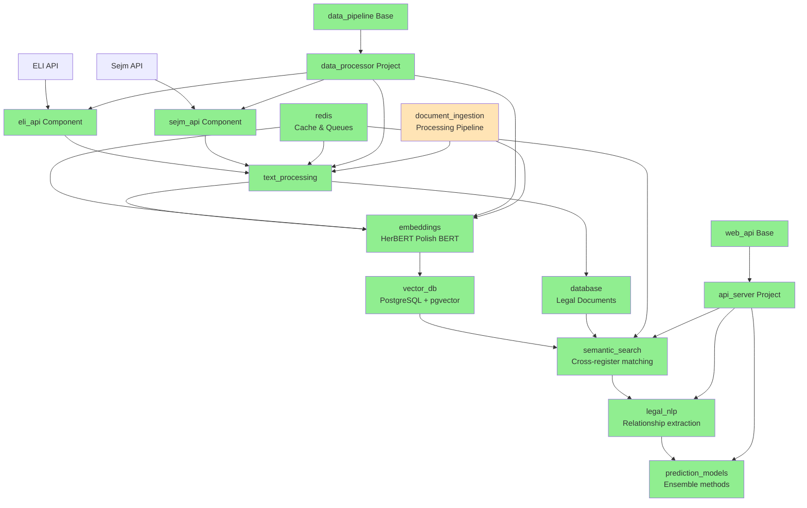
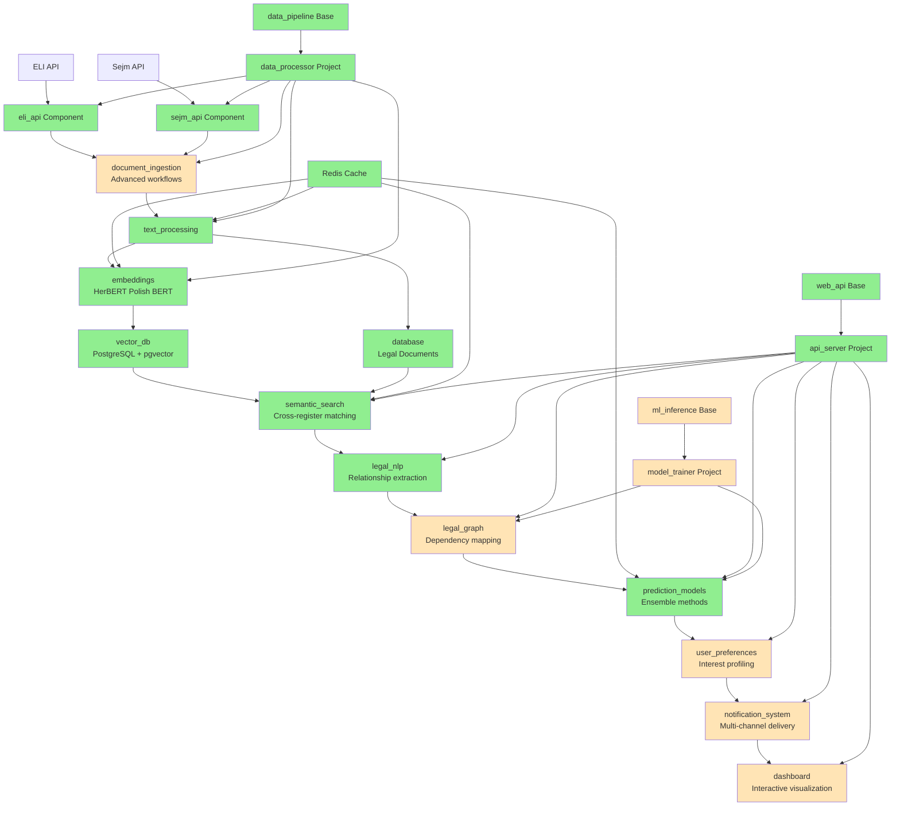

# Sejm-Whiz: Polish Legal Change Prediction System

**Goal**: Predict changes in Polish law using data from Sejm (Polish Parliament) APIs
- **ELI API**: Effective law data from https://api.sejm.gov.pl/eli/openapi/
- **Sejm Proceedings API**: Parliamentary proceedings from https://api.sejm.gov.pl/sejm/openapi/

## Project Overview

This is a Python project structured as a Polylith workspace implementing an AI-driven legal prediction system using bag of embeddings for semantic similarity. The system monitors parliamentary proceedings and legal documents to predict future law changes with multi-act amendment detection and cross-reference analysis.

## Key Features

- **Multi-Act Amendment Detection**: Identifies complex omnibus legislation and cascading legal changes
- **Cross-Reference Analysis**: Maps relationships between legal acts and their dependencies
- **Semantic Search**: Uses HerBERT (Polish BERT) with bag of embeddings for document-level similarity
- **Real-Time Predictions**: Monitors parliamentary proceedings for early change indicators
- **User Interest Profiling**: Personalized notifications based on legal domain preferences
- **GPU-Optimized Inference**: Local processing on NVIDIA GTX 1060 6GB

## Data Pipeline Architecture

### Current Implementation State (Updated)



### Planned Complete State



**Legend:**
- 🟢 Green: Implemented components/projects
- 🟡 Orange: Planned components/projects

## Architecture

Follows Polylith architecture pattern with planned components:

### Components

**✅ Implemented:**
- `database` - PostgreSQL + pgvector operations with Alembic migrations
- `eli_api` - ELI API integration with comprehensive legal document parsing, batch processing controls, and security features
- `sejm_api` - Sejm Proceedings API integration with comprehensive validation, rate limiting, and security features
- `vector_db` - Vector database operations with pgvector for semantic similarity search and embeddings storage
- `text_processing` - Polish legal text processing with cleaning, normalization, tokenization, and entity extraction
- `embeddings` - HerBERT embeddings with comprehensive Polish BERT implementation, bag-of-embeddings approach, batch processing, similarity calculations, and GPU optimization
- `redis` - Caching and queue management for background tasks and embedding operations
- `legal_nlp` - Advanced legal document analysis with multi-act amendment detection, semantic analysis, and relationship extraction
- `prediction_models` - ML models for law change predictions with ensemble methods, similarity-based predictors, and classification models
- `semantic_search` - Embedding-based search and similarity with cross-register matching for legal vs parliamentary language
- `document_ingestion` - Document processing pipeline and ingestion workflows

**🚧 Planned:**
- `legal_graph` - Legal act dependency mapping and cross-reference analysis
- `user_preferences` - User interest profiling and subscription management
- `notification_system` - Multi-channel notification delivery
- `dashboard` - Interactive prediction visualization

### Bases

**✅ Implemented:**
- `web_api` - FastAPI web server base with comprehensive error handling, CORS support, health endpoints, and API documentation
- `data_pipeline` - Data processing base with pipeline orchestration, batch processing, and error handling

**🚧 Planned:**
- `ml_inference` - Model inference base

### Projects

**✅ Implemented:**
- `api_server` - Main web API server combining web_api base with FastAPI application, health endpoints, and API documentation
- `data_processor` - Batch processing project combining data_pipeline base with ingestion components for processing Polish legal data

**🚧 Planned:**
- `model_trainer` - ML training and validation workflows

## Technology Stack

- **Language**: Python 3.12+
- **Architecture**: Polylith monorepo with components and projects
- **Package Management**: uv with polylith-cli
- **Web Framework**: FastAPI with async support
- **Database**: PostgreSQL 17 with pgvector extension
- **Cache**: Redis 7+
- **ML Framework**: PyTorch with CUDA support
- **Embedding Models**: HerBERT (Polish BERT)
- **Orchestration**: k3s (single-node Kubernetes) with Helm charts
- **Container**: Docker with NVIDIA Container Toolkit

## Quick Start

1. **Install dependencies**:
   ```bash
   uv sync --dev
   ```

2. **Check workspace status**:
   ```bash
   uv run poly info
   ```

3. **Run tests**:
   ```bash
   uv run poly test
   ```

4. **Run database tests**:
   ```bash
   uv run python test_database.py
   ```

5. **Test embeddings system**:
   ```bash
   uv run pytest test/components/sejm_whiz/embeddings/ -v
   ```

6. **Test HerBERT embeddings**:
   ```bash
   # Test individual embedding components
   uv run pytest test/components/sejm_whiz/embeddings/test_herbert_encoder.py -v
   uv run pytest test/components/sejm_whiz/embeddings/test_bag_embeddings.py -v
   uv run pytest test/components/sejm_whiz/embeddings/test_similarity.py -v
   uv run pytest test/components/sejm_whiz/embeddings/test_batch_processor.py -v
   ```

7. **Test legal NLP analysis**:
   ```bash
   # Test legal document analysis components
   uv run pytest test/components/sejm_whiz/legal_nlp/test_core.py -v
   uv run pytest test/components/sejm_whiz/legal_nlp/test_semantic_analyzer.py -v
   uv run pytest test/components/sejm_whiz/legal_nlp/test_relationship_extractor.py -v
   uv run pytest test/components/sejm_whiz/legal_nlp/test_integration.py -v
   ```

8. **Run API server**:
   ```bash
   # Start the web API server
   uv run python projects/api_server/main.py
   
   # Or with uvicorn for development
   uv run uvicorn projects.api_server.main:app --host 0.0.0.0 --port 8000 --reload
   ```

9. **Run data processor**:
   ```bash
   # Start the batch data processing pipeline
   uv run python projects/data_processor/main.py
   ```

10. **Test web API base**:
   ```bash
   # Test web API base implementation
   uv run pytest test/bases/sejm_whiz/web_api/test_core.py -v
   ```

11. **Test semantic search**:
   ```bash
   # Test semantic search components
   uv run pytest test/components/sejm_whiz/semantic_search/test_search_engine.py -v
   uv run pytest test/components/sejm_whiz/semantic_search/test_indexer.py -v
   uv run pytest test/components/sejm_whiz/semantic_search/test_ranker.py -v
   uv run pytest test/components/sejm_whiz/semantic_search/test_cross_register.py -v
   ```

12. **Deploy to k3s** (see `K3S_DEPLOYMENT.md` for full instructions):
   ```bash
   # Build and deploy containers
   docker build -t sejm-whiz-api:latest -f Dockerfile.api .
   docker build -t sejm-whiz-processor:latest -f Dockerfile.processor .
   ```

## Development Commands

### Package Management
- `uv sync --dev` - Install all dependencies including dev dependencies
- `uv add <package>` - Add a new dependency
- `uv remove <package>` - Remove a dependency

### Polylith Workspace Management
- `uv run poly info` - Show workspace summary
- `uv run poly check` - Validate the Polylith workspace
- `uv run poly sync` - Update pyproject.toml with missing bricks
- `uv run poly create component <name>` - Create a new component
- `uv run poly create base <name>` - Create a new base
- `uv run poly create project <name>` - Create a new project
- `uv run poly test` - Run tests across the workspace
- `uv run poly deps` - Visualize dependencies between bricks
- `uv run poly build` - Build packages

## Current State

**Phase 1 - Infrastructure Setup**: ✅ **COMPLETED**
- PostgreSQL database with pgvector extension configured
- Alembic migrations system in place
- Docker containerization with Dockerfile.api and Dockerfile.processor
- k3s deployment documentation ready

**Phase 2 - Core Components**: ✅ **COMPLETED**
- Database component implemented and functional ✅
- ELI API component completed with advanced legal document processing and security features ✅
- Sejm API component completed with comprehensive security features ✅
- Vector DB component completed with pgvector similarity search and embeddings storage ✅
- Text Processing component completed with Polish legal text processing pipeline ✅
- Embeddings component completed with comprehensive HerBERT Polish BERT implementation ✅
- Redis component completed with caching, queue management, and health monitoring ✅
- Legal NLP component completed with advanced document analysis, semantic fields detection, and relationship extraction ✅
- Prediction Models component completed with ensemble methods, similarity-based predictors, and classification models ✅

**Phase 3 - Advanced Components**: ✅ **COMPLETED**
- Semantic search component completed with cross-register matching ✅
- Document ingestion component completed with advanced processing workflows ✅

**Phase 4 - Project Assembly**: ✅ **COMPLETED**
- Web API base completed with FastAPI application factory and comprehensive features ✅
- API server project completed with web server implementation ✅
- Data pipeline base completed with pipeline orchestration and batch processing ✅
- Data processor project completed with comprehensive ingestion pipeline ✅

**Phase 5 - Advanced Features**: 🚧 **PLANNED**
- Legal graph component for dependency mapping
- Model trainer project for ML training workflows
- User preferences component for interest profiling
- Notification system for multi-channel delivery
- Dashboard component for interactive visualization

See `IMPLEMENTATION_PLAN.md` for detailed development roadmap and `K3S_DEPLOYMENT.md` for deployment instructions.

## Hardware Requirements

- **GPU**: NVIDIA GeForce GTX 1060 6GB (minimum)
- **RAM**: 16GB+ recommended
- **Storage**: NVMe SSD for vector index performance
- **CUDA**: Version 11.8 or compatible

## Contributing

This project follows the Polylith architecture principles:
- Components should be small, reusable, and do one thing well
- Use the `sejm_whiz` namespace for all code
- Follow component isolation principles
- Test components independently using `poly test`

## License

[License information to be added]
