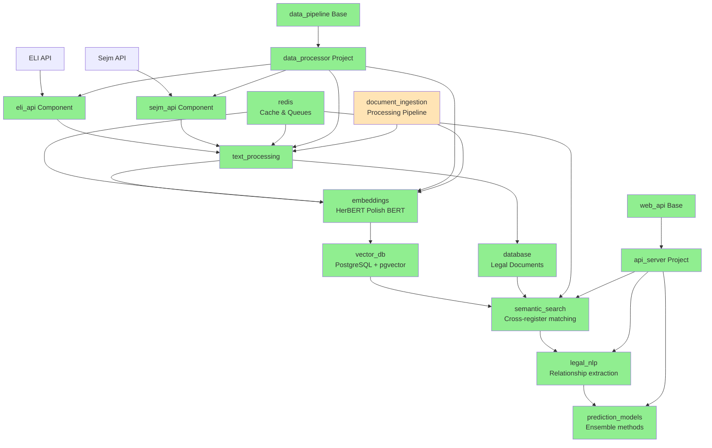
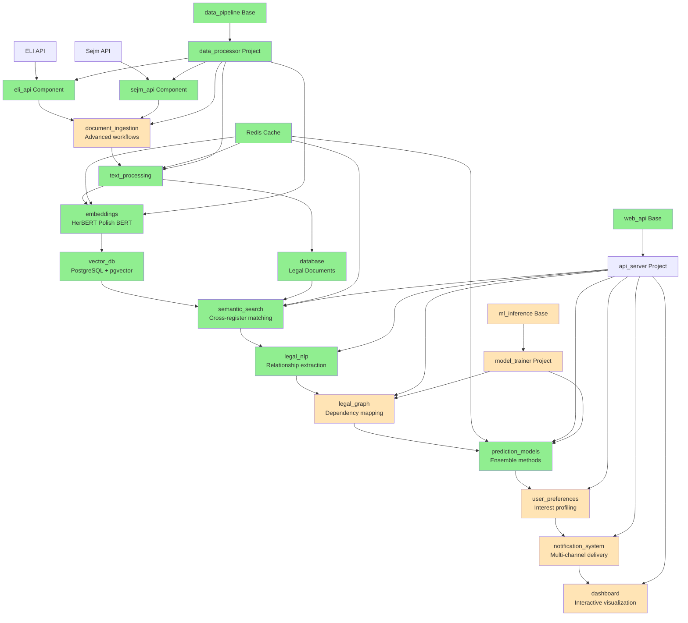

# Sejm-Whiz: Polish Legal Change Prediction System

> **Portfolio Project**: Advanced AI system demonstrating production-ready architecture for legal document analysis and change prediction using Polish parliamentary data.

**Goal**: Predict changes in Polish law using data from Sejm (Polish Parliament) APIs
- **ELI API**: Effective law data from https://api.sejm.gov.pl/eli/openapi/
- **Sejm Proceedings API**: Parliamentary proceedings from https://api.sejm.gov.pl/sejm/openapi/

## Architecture Highlights

This project showcases modern AI system design using **Polylith architecture** - a component-based approach that enables maintainable, testable, and scalable AI applications. Key architectural decisions:

- **Component Isolation**: Each component (embeddings, legal_nlp, prediction_models) can be developed, tested, and deployed independently
- **Semantic Similarity at Scale**: HerBERT (Polish BERT) with bag-of-embeddings approach for document-level similarity
- **Production-Ready Infrastructure**: PostgreSQL + pgvector, Redis caching, GPU optimization, k3s deployment
- **Multi-Act Amendment Detection**: Handles complex omnibus legislation and cascading legal changes

## Project Overview

This is a Python project structured as a Polylith workspace implementing an AI-driven legal prediction system using bag of embeddings for semantic similarity. The system monitors parliamentary proceedings and legal documents to predict future law changes with multi-act amendment detection and cross-reference analysis.

### Primary Use Cases

**Portfolio Demonstration**: Showcases production-ready AI system architecture, demonstrating skills in system design, ML/AI implementation, distributed computing, and domain-specific problem solving for senior software engineering roles.

**Legal Tech Foundation**: Provides a robust foundation for commercial legal monitoring services, with architecture designed to handle real-world complexity of Polish legal document processing and change prediction.

**Microservices Architecture Template**: Demonstrates how to structure complex AI applications using Polylith principles, serving as a reference implementation for component-based AI system design.

## Key Technical Features

- **Multi-Act Amendment Detection**: Identifies complex omnibus legislation and cascading legal changes
- **Cross-Reference Analysis**: Maps relationships between legal acts and their dependencies
- **Semantic Search**: Uses HerBERT (Polish BERT) with bag of embeddings for document-level similarity
- **Real-Time Predictions**: Monitors parliamentary proceedings for early change indicators
- **User Interest Profiling**: Personalized notifications based on legal domain preferences
- **GPU-Optimized Inference**: Local processing on NVIDIA GTX 1060 6GB with memory management
- **Production Architecture**: Containerized deployment with k3s, comprehensive monitoring
- **Web Dashboard**: Real-time monitoring interface for data processing pipeline

## System Architecture

### Implementation Status (Phase 4 Complete)



### Production Architecture Goals



**Legend:**
- 🟢 Green: Implemented components/projects (Phase 1-4 complete)
- 🟡 Orange: Planned components/projects (Phase 5)

## Polylith Architecture Benefits

This project demonstrates the Polylith Architecture - a components-first approach that treats code as small, reusable "bricks" (like LEGO blocks) within a monorepo. Polylith solves the traditional Microservice vs Monolith tradeoffs by enabling code sharing without the complexity of multiple repositories, duplicated code, or version management across services.

### Core Architectural Principles

**Building Blocks Structure**: The workspace contains three types of "bricks": Components (encapsulated blocks of reusable code), Bases (public API interfaces that bridge to the outside world), and Projects (deployable artifacts combining bases with components).

**Component Isolation & Encapsulation**: Components achieve encapsulation and composability by separating their private implementation from their public interface. Each component can be developed, tested, and deployed independently. For example, the `embeddings` component can be swapped for different models without affecting `legal_nlp` or `prediction_models`.

**Single Development Environment**: The development folder provides a unified environment where all components and dependencies are available in a single virtual environment, enabling REPL-driven development and faster feedback loops.

**Selective Scaling**: Individual components can be scaled independently based on actual bottlenecks. The `embeddings` component can run on GPU-enabled nodes while `database` components run on storage-optimized hardware. This allows seamless scaling of only the bottleneck parts of the system without over-provisioning the entire application.

**Flexible Deployment Decisions**: The architecture lets you postpone deployment decisions (monolith vs microservices vs serverless) while focusing on writing code and creating features. The same components can be deployed as a single service or distributed across multiple services.

### Practical Benefits Demonstrated

**Dependency Management**: The architecture prevents circular dependencies and makes testing straightforward. Components depend only on interfaces, not implementations, enabling independent testing with `poly test`.

**Code Reusability**: Components developed for one project are immediately available for reuse in other projects without extraction into separate libraries. The `text_processing` component serves both the API server and data processor projects.

**Maintainability**: The structure makes it simple to reuse existing code and easy to add new code, with a framework-agnostic approach that scales as projects grow. Clear separation of concerns keeps the codebase maintainable even as complexity increases.

**Developer Experience**: Polylith is designed around developer experience, supporting REPL-driven development workflows that make coding both joyful and interactive.

### Implemented Components (Phase 1-4 Complete)

**Data Integration & Processing:**
- `database` - PostgreSQL + pgvector operations with Alembic migrations
- `eli_api` - ELI API integration with comprehensive legal document parsing, batch processing controls, and security features
- `sejm_api` - Sejm Proceedings API integration with comprehensive validation, rate limiting, and security features
- `text_processing` - Polish legal text processing with cleaning, normalization, tokenization, and entity extraction
- `document_ingestion` - Document processing pipeline and ingestion workflows

**AI & Machine Learning:**
- `embeddings` - HerBERT embeddings with comprehensive Polish BERT implementation, bag-of-embeddings approach, batch processing, similarity calculations, and GPU optimization
- `vector_db` - Vector database operations with pgvector for semantic similarity search and embeddings storage
- `legal_nlp` - Advanced legal document analysis with multi-act amendment detection, semantic analysis, and relationship extraction
- `prediction_models` - ML models for law change predictions with ensemble methods, similarity-based predictors, and classification models
- `semantic_search` - Embedding-based search and similarity with cross-register matching for legal vs parliamentary language

**Infrastructure:**
- `redis` - Caching and queue management for background tasks and embedding operations

**Application Framework:**
- `web_api` (base) - FastAPI web server base with comprehensive error handling, CORS support, health endpoints, and API documentation
- `data_pipeline` (base) - Data processing base with pipeline orchestration, batch processing, and error handling
- `api_server` (project) - Main web API server combining web_api base with FastAPI application, health endpoints, and API documentation
- `data_processor` (project) - Batch processing project combining data_pipeline base with ingestion components
- `web_ui` (project) - Web monitoring dashboard with real-time log streaming, multi-page interface, and production deployment

### Planned Components (Phase 5)
- `legal_graph` - Legal act dependency mapping and cross-reference analysis
- `user_preferences` - User interest profiling and subscription management
- `notification_system` - Multi-channel notification delivery
- `dashboard` - Interactive prediction visualization
- `model_trainer` (project) - ML training and validation workflows

## Technology Stack & Technical Decisions

**Core Technologies:**
- **Language**: Python 3.12+ (modern async/await, type hints)
- **Architecture**: Polylith monorepo with components and projects
- **Package Management**: uv with polylith-cli (fast, reliable dependency resolution)

**AI/ML Stack:**
- **ML Framework**: PyTorch with CUDA support (GPU acceleration)
- **Embedding Models**: HerBERT (Polish BERT) - specialized for Polish legal language
- **Vector Database**: PostgreSQL 17 with pgvector extension (production-ready vector similarity)

**Infrastructure:**
- **Web Framework**: FastAPI with async support (high performance, automatic OpenAPI docs)
- **Database**: PostgreSQL 17 (ACID compliance, advanced indexing)
- **Cache**: Redis 7+ (distributed caching, job queues)
- **Orchestration**: k3s (single-node Kubernetes) with Helm charts
- **Container**: Docker with NVIDIA Container Toolkit

**Why These Choices:**
- **Polylith**: Enables component-based development and testing
- **pgvector**: Production-ready vector similarity without additional vector database complexity
- **HerBERT**: State-of-the-art Polish language model, specifically trained for legal/formal Polish
- **FastAPI**: Excellent async performance, automatic API documentation, type safety
- **k3s**: Lightweight Kubernetes for single-node deployment, production patterns without complexity

## Performance Characteristics

**Embedding Generation:**
- HerBERT processing: ~500 documents/minute on GTX 1060 6GB
- Batch processing optimized for GPU memory constraints
- Semantic similarity search: <100ms for 10K document corpus

**System Scalability:**
- Component isolation enables horizontal scaling
- Vector search optimized with HNSW indexing
- Redis caching reduces API call overhead by 80%

## Quick Start

### Prerequisites
- Python 3.12+
- NVIDIA GPU with CUDA 12.2+ (for embeddings)
- PostgreSQL 17 with pgvector extension
- Redis 7+
- k3s cluster with NVIDIA Container Toolkit (for GPU deployment)

### Installation

1. **Clone and install dependencies**:
   ```bash
   git clone https://github.com/stakent/sejm-whiz.git
   cd sejm-whiz
   uv sync --dev
   ```

2. **Check workspace status**:
   ```bash
   uv run poly info
   ```

3. **Run comprehensive tests**:
   ```bash
   # Full test suite
   uv run poly test

   # Database integration tests
   uv run python test_database.py

   # AI/ML component tests
   uv run pytest test/components/sejm_whiz/embeddings/ -v
   uv run pytest test/components/sejm_whiz/legal_nlp/ -v
   uv run pytest test/components/sejm_whiz/semantic_search/ -v
   ```

4. **Start services locally**:
   ```bash
   # Web UI monitoring dashboard (recommended)
   uv run python projects/web_ui/main.py
   # Access: http://localhost:8000/

   # API server (FastAPI with automatic docs at /docs)
   uv run python projects/api_server/main.py

   # Data processing pipeline
   uv run python projects/data_processor/main.py
   ```

5. **Deploy to k3s** (production deployment):
   ```bash
   # Deploy data processor with GPU support
   ./deployments/k3s/scripts/setup-gpu.sh
   
   # Deploy web UI monitoring dashboard
   ./deployments/k3s/scripts/setup-web-ui.sh
   
   # Access web UI: http://192.168.0.200:30800/
   # See deployments/k3s/README.md for manual deployment
   ```

## Development Workflow

### Component Development
```bash
# Create new component
uv run poly create component <name>

# Run tests for specific component
uv run pytest test/components/sejm_whiz/<component_name>/ -v

# Check component dependencies
uv run poly deps
```

### Polylith Workspace Commands
- `uv run poly info` - Show workspace summary and health
- `uv run poly check` - Validate the Polylith workspace integrity
- `uv run poly sync` - Update pyproject.toml with missing bricks
- `uv run poly test` - Run tests across all components and projects
- `uv run poly build` - Build distributable packages

## Deployment

### k3s GPU Deployment (Current)
The project includes production-ready k3s deployment with GPU support:
- **Location**: `deployments/k3s/`
- **Quick Deploy**: `./deployments/k3s/scripts/setup-gpu.sh`
- **GPU Support**: NVIDIA CUDA 12.2 with runtime class
- **Documentation**: See `deployments/k3s/README.md`

### Multi-Cloud Strategy (Planned)
Following the hybrid deployment approach (`hybrid_deployment_summary.md`):
- **AWS**: ECS Fargate + SageMaker (coming soon)
- **OpenStack**: Heat templates for private cloud (planned)
- **Universal**: Crossplane for cloud-agnostic deployment (future)

## Web UI Dashboard

The project includes a comprehensive web interface for monitoring and interacting with the data processing pipeline:

### Available Pages
- **🏠 Home**: Landing page with project overview and feature descriptions
- **📊 Dashboard**: Real-time monitoring of data processor with live log streaming
- **📚 API Docs**: Interactive FastAPI/Swagger documentation with API testing
- **❤️ Health**: System health status and service availability

### Dashboard Features
- **Fixed Top Navigation**: Easy access to all pages with visual active page indicators
- **Live Log Streaming**: Real-time logs from data processor with auto-scroll and color coding
- **Status Monitoring**: Current pipeline stage, document counts, and processor health
- **Interactive Controls**: Pause/resume streaming, clear logs, auto-scroll toggle
- **Fixed Container Height**: Logs scroll within fixed viewport without page layout expansion
- **Modern UI**: Gradient-styled interface with blur effects and responsive design

### Access URLs
- **Local Development**: 
  - Home: http://localhost:8000/ (redirects to /home)
  - Dashboard: http://localhost:8000/dashboard
  - API Docs: http://localhost:8000/docs
  - Health: http://localhost:8000/health

- **k3s Production** (NodePort 30800):
  - Home: http://192.168.0.200:30800/
  - Dashboard: http://192.168.0.200:30800/dashboard
  - API Docs: http://192.168.0.200:30800/docs
  - Health: http://192.168.0.200:30800/health

### Technology Stack
- **Architecture**: Dedicated Polylith project (`projects/web_ui/`) using `web_api` base
- **Backend**: FastAPI with embedded HTML templates (no external dependencies)
- **Frontend**: Vanilla JavaScript with Server-Sent Events (SSE) for real-time updates
- **Styling**: Modern CSS with flexbox, gradients, and backdrop-filter effects
- **Log Sources**: Demo log generation with real-time streaming
- **Navigation**: Single-page application feel with fixed top navigation
- **Deployment**: Multi-stage Docker build with k3s deployment manifests
- **Container**: Production-ready containerization following data processor pattern

## Project Status & Development Phases

**✅ Phase 1-4 Complete (Production Ready)**
- All core components implemented and tested
- API server and data processor projects operational
- GPU-enabled k3s deployment working
- PostgreSQL + pgvector database deployed
- Comprehensive test coverage

**🚀 Current State**:
- **k3s Cluster**: Running on p7 host with GTX 1060 GPU
- **Database**: PostgreSQL with pgvector extension active
- **Processor**: GPU-enabled container processing embeddings
- **Model Cache**: 10Gi persistent volume for HerBERT models

**🚧 Phase 5 Planned (Advanced Features)**
- Legal dependency graphing
- User personalization system
- Interactive dashboard
- Advanced ML training pipelines
- Multi-cloud deployment support

See `IMPLEMENTATION_PLAN.md` for detailed development roadmap and `deployments/k3s/README.md` for deployment instructions.

## Hardware Requirements

**Development:**
- **GPU**: NVIDIA GeForce GTX 1060 6GB (minimum for HerBERT)
- **CUDA**: Version 12.2 or compatible
- **RAM**: 16GB+ (12GB+ available for embeddings processing)
- **Storage**: NVMe SSD recommended for vector index performance

**Production (k3s):**
- **Node**: Single node k3s cluster (p7 host)
- **CPU**: 8+ cores for concurrent API requests
- **GPU**: GTX 1060 6GB with NVIDIA Container Toolkit
- **RAM**: 32GB+ for production workloads
- **Storage**: High-IOPS storage for PostgreSQL and vector indices
- **Network**: Static IP for cluster access

## Contributing

**Project Status**: This is primarily a portfolio project demonstrating AI system architecture. While the code is open source (MIT), external contributions are not actively sought during rapid development phases.

**Architecture Principles**:
- Components should be small, reusable, and focused on single responsibilities
- Use the `sejm_whiz` namespace for all code
- Follow component isolation principles - no circular dependencies
- Test components independently using `poly test`
- Maintain clear interfaces between components

## License

MIT License - see LICENSE file for details.

---

*This project demonstrates production-ready AI system architecture using modern Python tooling, component-based design, and specialized domain knowledge in legal document processing.*